# tide: design spec (milestone 1)

tide is a small Wayland desktop: **Hyprland** tiles the windows, one
**Quickshell** process draws everything else (bar, launcher, notifications,
OSDs, share picker), the same QML draws the lock and login screens, and
**greetd** logs you in. It is
built for one workflow, dwm/Krohnkite-style tiling on an ultrawide plus a
laptop, rather than as a general-purpose desktop. It aims to be lighter than
KDE and not to fight itself.

This document is milestone 1: the options, the decisions, and what
"done" looks like for each later milestone. Mocks are in
[`docs/mocks/`](docs/mocks/); every claim about an upstream project was
checked against its current release on 2026-09-28 (see
[Sources](#sources)), except in §21.1 and §21.2, deferred explorations that
say which of their claims were checked.

Contents:
[Goals](#1-goals) ·
[Mocks](#2-mocks) ·
[Decisions](#3-decisions) ·
[Requirements](#4-requirements-and-how-each-is-met) ·
[Session](#5-session-one-owner-per-job) ·
[Windows](#6-windows-and-layouts) ·
[Bar](#7-bar) ·
[Launcher](#8-launcher) ·
[Notifications](#9-notifications) ·
[Idle and lock](#10-idle-screensaver-and-lock) ·
[Login](#11-login) ·
[Screen sharing](#12-screen-sharing-google-meet) ·
[Screenshots](#13-screenshots) ·
[Focus](#14-focus-and-attention) ·
[Theme](#15-theme) ·
[Settings and apps](#16-settings) ·
[Known problems](#17-known-problems-and-how-this-design-avoids-them) ·
[Repos](#18-where-things-live) ·
[Milestones](#19-milestones) ·
[Testing](#20-testing) ·
[Open questions](#21-open-questions)

---

## 1. Goals

**Must have**

- Tiling in the dwm/Krohnkite style, never binary-space partitioning:
  master + stack, three columns, two columns + a stack, monocle. Layout is
  per workspace. Any window can be maximized or made fullscreen on its own,
  and dialogs always float.
- A lone window is centered at **80%** width on an ultrawide and fills
  **100%** on a 16:9 or 16:10 monitor.
- Inactive windows are **darkened**. That is the focus cue: no borders, no
  gaps.
- One full-width bar: every workspace on the left, with **urgency** shown on
  the workspace that wants attention. The tray, network, volume, Bluetooth,
  power and notifications sit on the right, then four clocks:
  **America/Los_Angeles**, **America/New_York** and **Europe/London**, labeled `SF`, `NYC`,
  `LON`, and local (no label; the date in its place).
- A launcher on a **tap of Super**: fuzzy search over `.desktop` entries plus
  quick actions (screenshot window/screen, log out, settings, …).
- Desktop notifications with history and do-not-disturb.
- **Automatic light and dark modes**: light from 07:00 to 19:00 by default.
  The shell, GTK apps and kitty switch live with no restarts; Qt apps switch
  live where their theme allows, otherwise at their next launch (§15).
- A screensaver/idle policy, and a lock screen that is the **same screen as
  the login screen**, showing the short hostname.
- **Google Meet screen sharing** that works in Chrome, including sharing a
  single window or a 16:9 slice of an ultrawide.
- Screenshots of a window, a screen or a region.
- A session that starts **exactly one of each thing** and nothing twice.

**Non-goals**

- Writing a compositor, or reimplementing tiling in the shell.
- A settings suite, file manager, widget system or app store. tide
  links to existing GTK tools where a GUI is needed (§16).
- An X11 session. XWayland apps work, but nothing is designed for X11.
- Being a framework. Settings exist where hardware differs (monitors,
  clocks, idle timings), not for their own sake.

**Principles**

1. **One owner per job.** Every job in the session is done by exactly one
   named component, and everything else that could do it is kept out (§5).
2. **One process for everything you see.** The bar, launcher, notifications,
   OSD, polkit prompt, tray host and share picker are all in the shell. With
   nothing to fight over, there is one theme and one place to debug. The one
   deliberate exception is the **lock**. It uses the same QML, but runs as its
   own short-lived process, so a bar crash or a hot reload can never break a
   locked screen.
3. **The compositor does windows.** The shell reads compositor state and sends
   commands; it never computes window geometry.
4. **Nothing restarts to change theme or reload config.**
5. **Every requirement names its mechanism** (§4), and each mechanism is
   verified on the pinned versions before it's relied on.

## 2. Mocks

The mocks are HTML/CSS in [`docs/mocks/`](docs/mocks/), rendered to PNG with
`make mocks`. Colors, spacing and type are the proposed defaults: a
libadwaita palette, with Inter for UI text and Ubuntu Mono for code. The
fonts mock shows the pairings that were compared. The shell sets type in
whole pixels, since Qt's `font.pixelSize` takes only an integer, so a
mock's half-pixel size is rounded up: 12.5px is 13.

| | |
|---|---|
| **Desktop**: 3440×1440, three-column layout, focused master in the middle, the rest dimmed. Workspace 4 is urgent. [`desktop.png`](docs/mocks/desktop.png) | 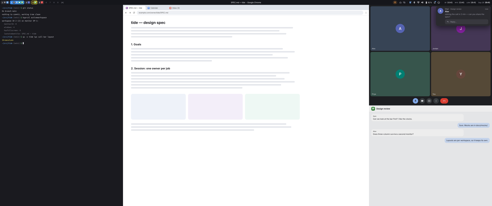 |
| **Bar**: dark and light, every workspace and status state, the clock rules. [`bar.png`](docs/mocks/bar.png) | 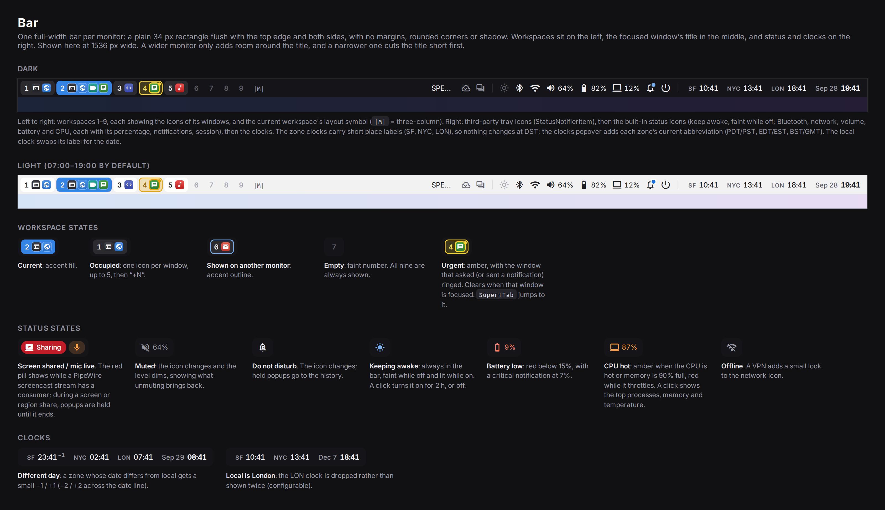 |
| **Layouts**: tile, three-column, two columns + stack, monocle, the single-window rule, and how three-column fills up. [`layouts.png`](docs/mocks/layouts.png) |  |
| **Launcher**: empty query and a fuzzy query. [`launcher.png`](docs/mocks/launcher.png) | 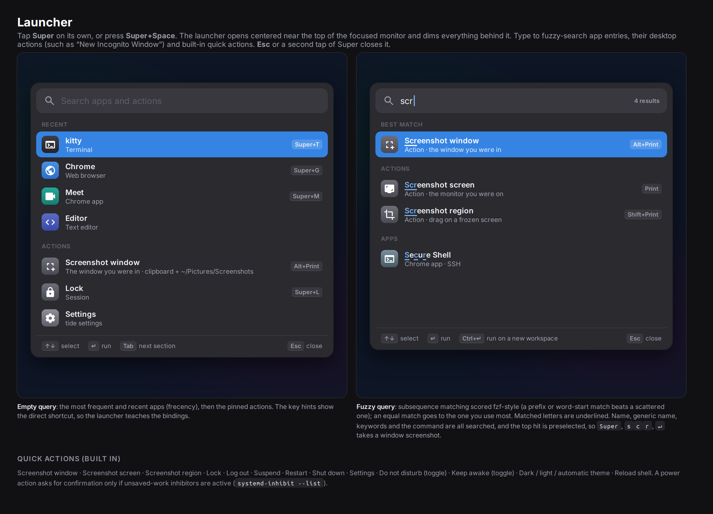 |
| **Notifications**: popups, OSD, the notification center while sharing. [`notifications.png`](docs/mocks/notifications.png) | 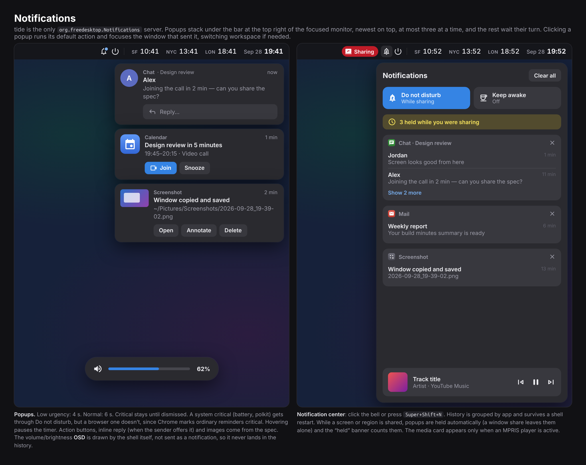 |
| **Clocks popover**: zones, working-hours strips, DST warning, calendar. [`clocks.png`](docs/mocks/clocks.png) | 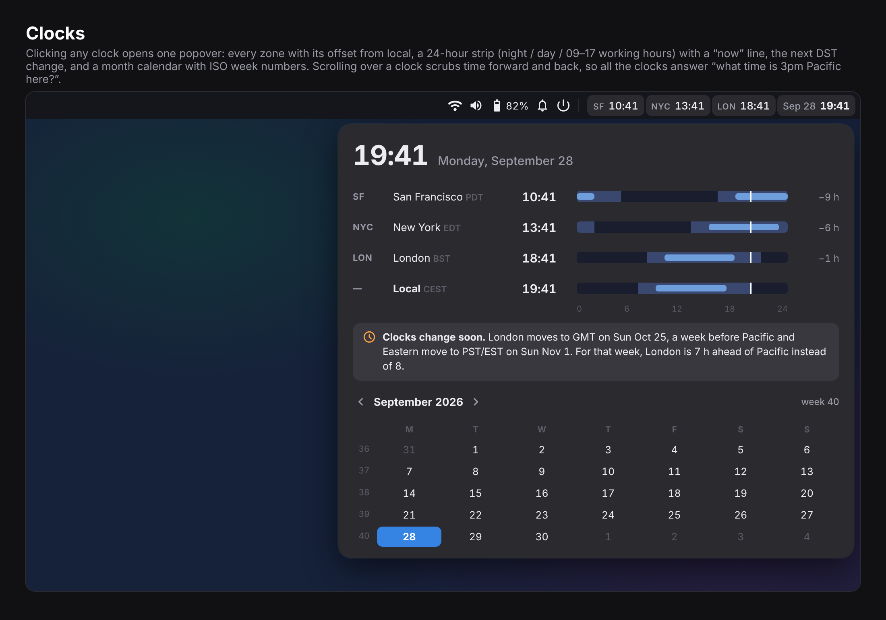 |
| **System monitor popover**: the CPU and Memory tabs, and throttling. [`sysmon.png`](docs/mocks/sysmon.png) | 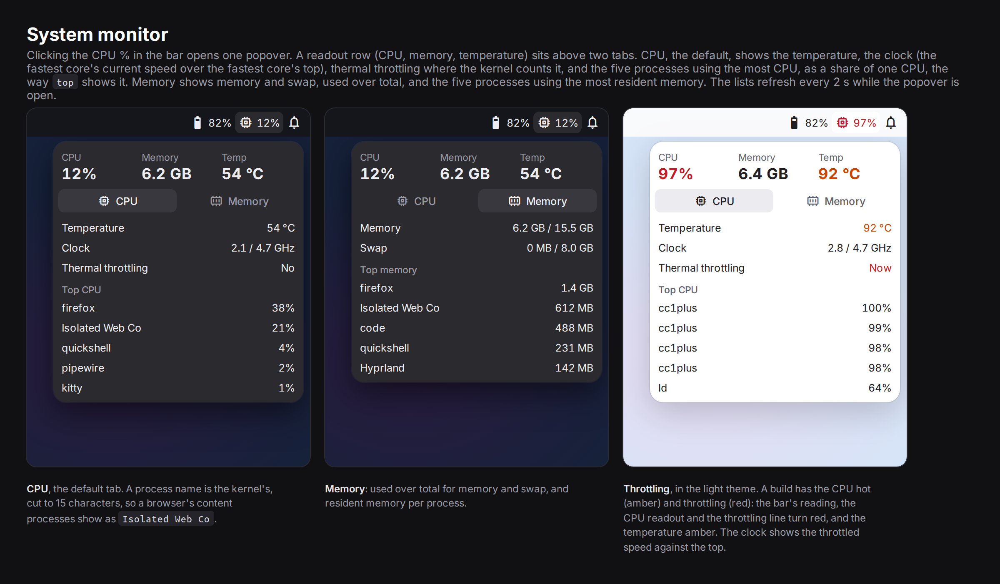 |
| **Login and lock**: greeter, lock, failure, screensaver. [`lock.png`](docs/mocks/lock.png) | 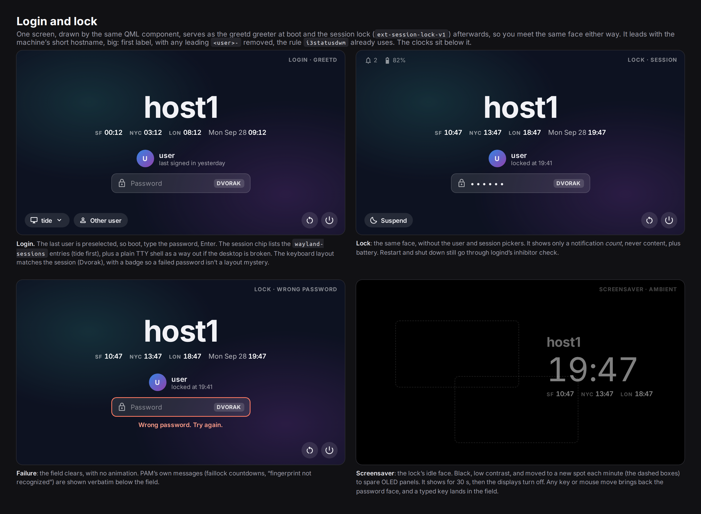 |
| **Screen-share picker**: screens, windows, 16:9 area. [`share-picker.png`](docs/mocks/share-picker.png) | 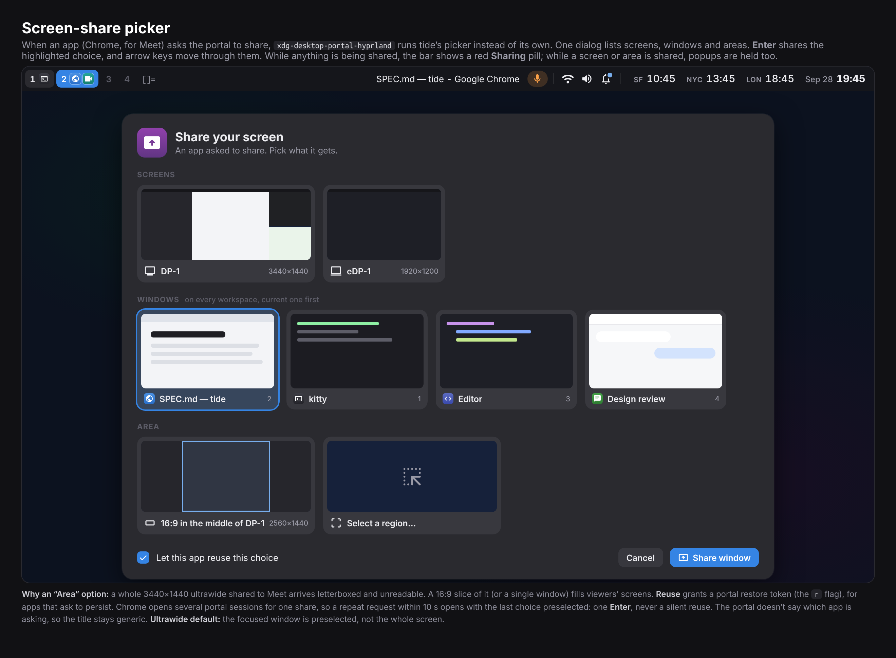 |
| **Screenshots**: region and window modes. [`screenshot.png`](docs/mocks/screenshot.png) | 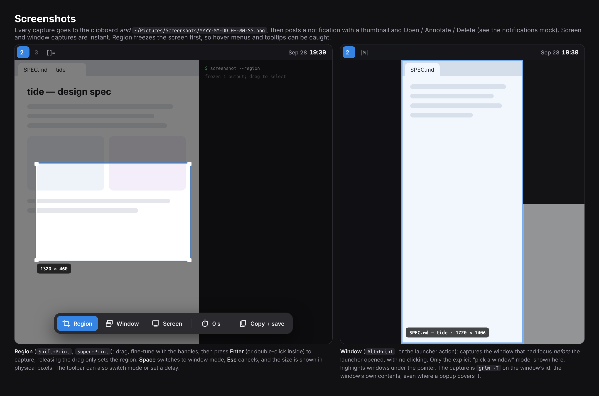 |
| **Fonts**: the same pieces in Ubuntu + Ubuntu Mono, Ubuntu Sans + Ubuntu Sans Mono, and Inter + JetBrains Mono. [`fonts.png`](docs/mocks/fonts.png) | 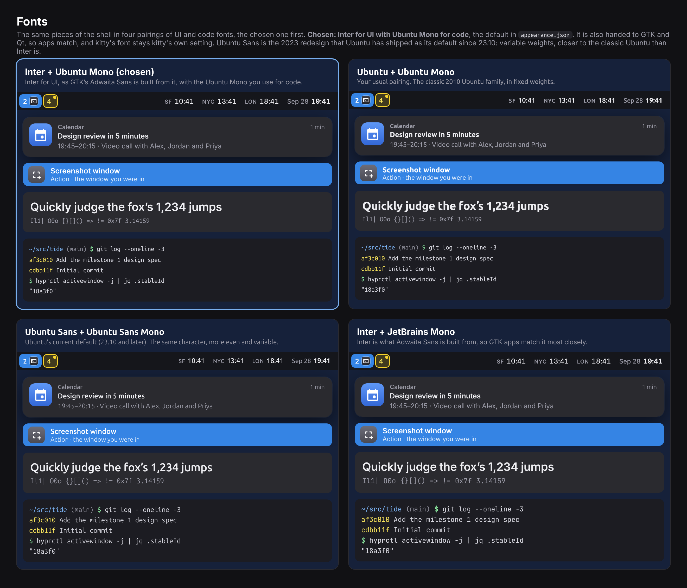 |

## 3. Decisions

### 3.1 Compositor: Hyprland 0.56+, configured in Lua

| | tile | three-col | two cols + stack | lone window 80% / 100% | per-workspace layout | urgency | fit |
|---|---|---|---|---|---|---|---|
| **Hyprland 0.56** | master | master `orientation center` | Lua layout (~50 lines) | Lua layout, or a `w[tv1] m[…]` gaps rule | yes (0.54+) | `urgent>>` event, per-window flag | **chosen** |
| river 0.4 + kwm / river-classic + filtile | yes | yes | own generator | filtile `smart-padding-h` | per tag | none in river 0.4's protocol | runner-up |
| MangoWC 0.17 | tile | `center_tile` | C patch | `center_tile` at mfact | per tag | yes | close |
| niri 26.04 | — | — | — | `default-column-width 0.8` | — | yes | scrolling, not dwm |
| Sway 1.12 | persway `stack_main` | — | — | `smart_gaps` hack | — | yes | manual tree |
| KWin + Krohnkite | yes | yes | — | `soleWindowWidth` per output | yes | yes | not light |

**Why Hyprland.**

- Its master layout already does tile and three-column.
- Since 0.54 a layout can be set **per workspace**, and monocle is built in.
- Since 0.55 a custom layout can be written in **Lua** (`hl.layout.register`)
  with no C++ plugin to rebuild. One Lua layout covers all four modes,
  including the one Hyprland lacks (two columns + stack), and the
  single-window width rule.
- `xdg-desktop-portal-hyprland` shares single windows and regions, and it
  accepts a custom picker.
- Its IPC reports urgency.
- The existing config in `conf` is a head start.

**What it costs.** Hyprland breaks config often: window rules changed syntax
in 0.53, layouts were rewritten in 0.54, Lua arrived in 0.55, `.conf` was
deprecated in 0.56.1 and is due to be removed in 0.57. The mitigations are:

- Write the config in Lua now.
- Pin the Hyprland version `setup` installs.
- Make CI load the config under the pinned Hyprland (`hypr_test.sh` already
  exists in `conf`).
- Treat each Hyprland upgrade as its own PR.

The Lua layout API is two releases old, so it is the riskiest dependency.
If it breaks, the fallback is Hyprland's built-in master and monocle layouts
with a gaps rule for the lone window. That loses two columns + stack, not
Hyprland.

**Runner-up: river-classic plus a small layout generator**. The
river-layout-v3 protocol is tiny and stable, and a generator is a few
hundred lines in any language. It loses on the shell side: Quickshell has
no river module, and river 0.4's window-management protocol has no urgency.

### 3.2 Shell: Quickshell (QML), written from scratch

| | covers the list | toolkit | upkeep | verdict |
|---|---|---|---|---|
| **Quickshell 0.3** config of our own | everything built in (below) | Qt/QML, custom-drawn | small config; Quickshell tags 2–3 releases a year | **chosen** |
| DankMaterialShell 1.6 | everything and much more | Qt/QML (Quickshell) + Go backend | a large, fast-moving product; its UI is compiled into the binary since 1.6 | borrow from it (MIT), don't fork |
| AGS 3 / Astal | nearly everything (Hyprland, tray, notifd, wireplumber, network, bluetooth, auth, idle-notify, fuzzy app search) | real GTK4 widgets | TypeScript/GJS; Astal is an unreleased rolling branch | the GTK fallback |
| waybar + fuzzel + swaync + hyprlock/hypridle | yes, loosely | GTK3/4, several | four config dialects; the setup that fought itself before | stopgap only |

Quickshell's built-ins cover every job:

- **Hyprland**: workspaces and toplevels with `urgent`, and `dispatch()`.
- **SystemTray**: SNI + DBusMenu.
- **NotificationServer**.
- **Pipewire**.
- **UPower**, with power profiles.
- **Bluetooth**.
- **Networking** (NetworkManager).
- **Pam** and **Greetd**.
- **Polkit** agent (0.3).
- **WlSessionLock**.
- **IdleMonitor** / **IdleInhibitor**.
- **ScreencopyView**, for live thumbnails.
- **ToplevelManager**.
- **DesktopEntries**, including desktop actions.
- `qs ipc call <target> <fn>`, for keybinds.
- Hot reload.

The one thing to write ourselves is a small fuzzy scorer for the launcher.
Quickshell has no logind binding and no public D-Bus server module. That is
why hypridle keeps two jobs (§10): serving Chrome's idle inhibits and
bridging logind's lock and sleep signals.

**GTK or Qt.** A shell draws its own widgets, so its toolkit doesn't show; what
has to match is the palette, the type and the corner radii. Apps stay GTK, and
portal dialogs (file chooser) are GTK via `xdg-desktop-portal-gtk`. One
palette file drives the shell, GTK 3 (adw-gtk3), GTK 4/libadwaita and Qt
(qt6ct colors), and kitty follows the light/dark switch with its own themes
(§15). If real GTK widgets matter more than that,
AGS/Astal is the drop-in alternative with the same architecture. Nothing
else in this spec changes.

**Risks.**

- **Qt coupling.** Quickshell uses private Qt APIs and must be rebuilt for
  each Qt release.
- **Packaging.** Arch ships it in `extra`, Debian in testing/sid, and Fedora
  via COPR (the official package is unverified). Ubuntu has only a third-party
  PPA. `setup` should prefer the distro package and fall back to a pinned
  source build against the distro's Qt.
- **Version.** The shell needs Quickshell 0.3 or newer: 0.3.0 added
  `IdleInhibitor`, `IdleMonitor` and `Quickshell.Networking`, and an older
  `qs` can't load a file that names one, so there's no bar at all. Debian's
  package is 0.2.1 (its `qs --version`, 2026-10-06), so `setup` builds
  there, as it does where there's no package.
- **Memory** is unmeasured; M2 measures it and sets a budget.

### 3.3 Session: uwsm and systemd user units

Every long-running piece is a systemd user unit under a
[uwsm](https://github.com/Vladimir-csp/uwsm) session. It is ordered, restarted
on failure, scoped to this session only, and visible in one
`systemctl --user status`. §5 is the detail.

### 3.4 Login: greetd plus the tide greeter

greetd runs a stripped Hyprland with the tide greeter, the same QML screen
as the lock (§11). cage was the other candidate, and multiple monitors rule
it out (checked on cage 0.3.1):

- it has no layer shell, so a greeter can't put a surface on each output;
- its `-m extend` stretches one window across every output, and `-m last`
  uses only the last one connected.

Hyprland is installed for the session anyway, and its `hyprctl devices`
gives the greeter the same layout badge as the lock.

### 3.5 Look

- **Palette:** libadwaita, dark and light.
- **Type:** Inter for UI, Ubuntu Mono for code (decided; the pairings
  compared are in [`fonts.png`](docs/mocks/fonts.png)).
- **Radii:** 10–16 px.
- **Windows:** no gaps, no borders, inactive dim 0.07.
- **Bar:** 36 px.

## 4. Requirements and how each is met

| # | Requirement | Mechanism | Kind |
|---|---|---|---|
| R1 | Tile (master + stack) | Lua layout `lua:tide`, mode `tile`, `mfact 0.55` | Lua |
| R2 | Three columns | mode `threecol` (center from 3 windows) | Lua |
| R3 | Two columns + stack | mode `twocol` | Lua |
| R4 | Lone window 80% on ultrawide, 100% otherwise | the layout reads the work area's aspect, in every mode | Lua |
| R5 | Monocle, and maximize or fullscreen the current window | mode `monocle`; Hyprland `fullscreen` states 1 and 0 (§6.3) | Lua / native |
| R6 | Layout per workspace | the layout keeps a mode per workspace | Lua |
| R7 | Dim inactive; no borders, gaps | `decoration:dim_inactive`, `dim_strength 0.07`, `border_size 0`, gaps 0 | native |
| R8 | One full-width bar, flush to the edges, all workspaces | Quickshell `PanelWindow` per monitor + `Quickshell.Hyprland` | shell |
| R9 | Tray icons | `Quickshell.Services.SystemTray`; the shell is the SNI watcher | shell |
| R10 | Network, volume, Bluetooth, power | `Networking`, `Pipewire`, `Bluetooth`, `UPower` | shell |
| R11 | Labeled clocks for America/Los_Angeles, America/New_York, Europe/London | fixed place labels `SF` / `NYC` / `LON` by default; tzdata abbreviations (PDT/PST …), **not** CLDR, in the popover or on request (§7.3) | shell |
| R12 | Local clock shows the date | `MMM d` in place of a label | shell |
| R13 | Urgency on the workspace widget | Hyprland `urgent` on toplevel/workspace, plus attention derived from notifications, since Chrome can't flag urgency on Wayland (§14) | native + shell |
| R14 | Tap Super for the launcher | a release bind on `SUPER_L` → a Hyprland global shortcut → Quickshell `GlobalShortcut`. Fixed only on Hyprland main (after 0.56.2); `Super+Space` until the pinned version has it (§8) | native + shell |
| R15 | Fuzzy search of `.desktop` apps | `DesktopEntries` + our scorer | shell |
| R16 | Quick actions | a built-in action list | shell |
| R17 | Screenshots | `screenshot` script (grim, including `grim -T` for a window; slurp; wl-copy); region picked on one frozen `grim` capture, then cropped from it, after the MVP (§13) | scripts + shell |
| R18 | Notifications | `NotificationServer`; the shell owns the name | shell |
| R19 | Screensaver, idle, lock | §10 | shell + hypridle |
| R20 | Meet screen sharing | PipeWire + xdph + our picker | portal + shell |
| R21 | Login = lock screen, short hostname | greetd + `Greetd` + `WlSessionLock` sharing one component | shell |
| R22 | Automatic light/dark (light 07:00–19:00 by default, or sunrise to sunset) | the shell's schedule → gsettings `color-scheme` + adw-gtk3 + palette (§15) | shell |
| R23 | Nothing started twice | §5 | session |
| R24 | Dialogs float | Hyprland floats windows with a parent, modal or fixed-size windows; rules cover the rest; centered on the parent (§6.4) | native |

## 5. Session: one owner per job

### 5.1 What went wrong before

The July 2026 commit that removed Hyprland and Sway recorded no reason. What
is remembered: **two top bars** at once, a bar with rounded corners and gaps
to the screen edge instead of a plain rectangle, and "some stuff didn't
work". The old setup shows how it fought itself:

- **Two bars.** waybar was relaunched by `theme.sh`, not owned by anything.
  Under sway, a distro default config's `bar {}` block starts swaybar too;
  Debian's `/etc/sway/config` ships one. Either way, two things could draw a
  bar and nothing stopped the second.
- **A bar that floated.** waybar's CSS gave the bar margins and 6 px radii.
- **A notification daemon that wouldn't stay away.** `setup --purge-obsolete`
  exists because a packaged **swaync user unit kept starting**, even after the
  move to KDE. Packages ship user units and D-Bus activation files that start
  themselves in *every* session unless something scopes them.
- **Restarts as a feature.** `theme.sh` `pkill`s and relaunches waybar and
  swaync at 07:00 and 19:00.
  - Each restart drops the notification history.
  - It drops every tray registration; apps that don't re-register lose their
    icons.
  - It opens a window in which any D-Bus-activatable daemon (dunst, mako) can
    claim `org.freedesktop.Notifications` first.
- **Double starts.** `nm-applet` and `blueman-applet` were started by
  `exec-once` *and*, under uwsm, by their own XDG autostart entries.
- **Missing owners.** No polkit agent was enabled (the line is commented
  out), so GUI privilege prompts silently failed.
- **Races.** `sleep 1 && swww img` papered over the wallpaper daemon's
  startup.
- **Two desktops sharing one script tree.** The sway config ran scripts
  under `config/hypr/`.
- **KDE alongside.** Plasma's own XDG autostart entries without
  `OnlyShowIn=KDE` also run in other sessions.

### 5.2 Who owns what

| Job | Owner | Started by | Kept out |
|---|---|---|---|
| Compositor | Hyprland | uwsm `wayland-wm@tide-hyprland.service` | — |
| Bar (exactly one per monitor), launcher, OSD, wallpaper | tide (`qs -c tide`) | `tide.service` | waybar, swaybar, swww/swaybg, fuzzel/rofi aren't started; `doctor` counts top-layer bars |
| Notifications (`org.freedesktop.Notifications`) | tide | `tide.service`, before any app | dunst/mako/swaync: not installed; `doctor` flags any activatable one |
| Tray host (`org.kde.StatusNotifierWatcher`) | tide | `tide.service`, before any app | `nm-applet`, `blueman-applet`, `xembedsniproxy` not run |
| Polkit agent | tide (`Quickshell.Services.Polkit`) | `tide.service` | polkit-gnome/-kde agents not run |
| Lock screen | `tide-lock`, a separate Quickshell process with the same QML (`WlSessionLock` + PAM service `tide-lock`) | hypridle's `lock_cmd`, on logind's `Lock` signal → `tide-lock.service` | hyprlock not installed |
| Idle timeline, `org.freedesktop.ScreenSaver`, logind lock and sleep bridge | hypridle (§10) | `hypridle.service` | swayidle not run; the shell does not time idle |
| Screen-share picker | tide, via xdph `custom_picker_binary` | xdph, on demand | `hyprland-share-picker` |
| Portals | `xdg-desktop-portal` + `-hyprland` + `-gtk` | D-Bus activation | `-kde`, `-gnome`, `-wlr` never selected: `tide-portals.conf` names `hyprland;gtk` |
| Theme schedule | tide | `tide.service` | `theme-daemon.sh` retired |
| Audio | PipeWire + WirePlumber | their own socket units | PulseAudio |
| Network, Bluetooth | NetworkManager, BlueZ (system) | system units | tray applets |
| Secrets | gnome-keyring, unlocked by PAM at login | greetd PAM + `gnome-keyring-daemon.socket` | KWallet in this session |
| Lid, power button | logind's defaults (`HandleLidSwitch=suspend`, `HandleLidSwitchDocked=ignore`), plus a Hyprland `bindl` pair on the lid switch: closing it with an external monitor attached disables the internal panel, and opening it re-enables the panel with its configured mode and returns the panel's workspaces to it | logind / Hyprland | `lid.sh`'s own suspend logic, and the `HandleLidSwitch=ignore` drop-in the old `setup-hypr` installed |
| "Show in folder" (`org.freedesktop.FileManager1`) | Nautilus (§16.2) | D-Bus activation via tide's user-level service file → `tide-filemanager.service`, whose launcher picks Dolphin under Plasma and which stops with the session | the arbitrary pick between Dolphin's and Nautilus's system activation files |
| Terminal for `Terminal=true` apps | kitty, via `xdg-terminal-exec` | on demand | GLib's fallback list (Konsole) |
| Apps | you | `tide launch` from keybinds and the launcher, which waits for the shell to be ready, then runs `uwsm app --` (§5.4) | — |

**M2 transitional shell.** Until the Quickshell shell lands (M3 and M4),
`tide.service` runs `tide-shell` instead of `qs -c tide`.
It runs the Quickshell bar (`qs -c tide`) when Quickshell 0.3 or newer
and the shell are installed, and waybar otherwise (`TIDE_BAR` picks). An
older `qs` can't load the bar (§3.2), so the shell logs its version and
runs waybar, and `doctor` reports it. It
starts `conf`'s theme daemon, which runs swaync, and waybar when that's the
bar, and the first polkit agent it finds. It reports ready once swaync
owns `org.freedesktop.Notifications` and the bar's tray owns
`org.kde.StatusNotifierWatcher`. The polkit agent's registration isn't
observable from a script, so it isn't waited for. Its exit doesn't fail the
unit, either: an agent exits at once when another already holds the
session, and failing the unit for that restarted the bar in a loop at
login. The shell starts the agent alone again instead, after 5 s, doubling
to once a minute, so it takes over when the other agent goes and comes
back after a crash; `doctor` names the other agent. It also runs the
wallpaper (swww, or swaybg where swww isn't packaged; supervised but not
waited for) and, once, `conf`'s
`apply-input.sh`, which Hyprland's autostart ran before it shrank to
`uwsm finalize`.

With `TIDE_POLKIT=1` the shell is the polkit agent
(`Quickshell.Services.Polkit`), opt-in until it has run in a live session,
and `tide-shell` starts no other; under waybar, where the shell doesn't
run, it still starts the agent it finds. The shell's agent isn't in the
ready check yet either. It keeps the M2 agent's backoff: polkitd lets one
agent register per session, and Quickshell 0.3.1 only logs a refusal, so a
registration that hasn't happened 5 s on counts as refused, and the agent
is made again, waiting twice as long each time, up to a minute.
Quickshell's polkit module is optional at build time
(`-DSERVICE_POLKIT=OFF`, Quickshell 0.3.1's `BUILD.md`), and a missing
module fails every file that imports it. So the agent is a file of its
own, loaded only with `TIDE_POLKIT=1`, and a Quickshell built without
polkit still runs the shell when the agent is off. With it on, `tide
doctor` asks the shell (`qs -c tide ipc call polkit status`) whether its
agent was made and registered, since `tide-shell` then starts no other.

### 5.3 Start order

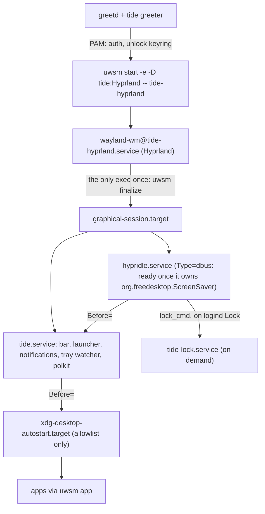

- **The session entry** is `tide.desktop` in `wayland-sessions`, so
  the current display manager lists it too (M2).
- **`-e -D tide:Hyprland`** sets `XDG_CURRENT_DESKTOP` to exactly that;
  without `-e`, uwsm appends to names from other sources.
- **`tide-hyprland`** is a wrapper that execs `start-hyprland`,
  Hyprland's crash watchdog, or `Hyprland` where that's missing. uwsm names a
  session after its compositor command, so the wrapper gives tide
  its own session target, `wayland-session@tide-hyprland.target`. A
  plain Hyprland login gets `wayland-session@hyprland.desktop.target`
  instead, and starts none of tide's units.

### 5.4 Guards that keep it that way

- **Scoped units.** tide's units are `WantedBy=` the tide
  session's target (`wayland-session@tide-hyprland.target`, §5.3) and
  `PartOf=graphical-session.target`, never plainly
  `WantedBy=graphical-session.target`. Plasma also reaches that target, and
  that is exactly how swaync leaked into KDE. Nothing tide installs
  starts in a KDE session.
- **Owners before clients.** `tide.service` is
  `Before=xdg-desktop-autostart.target`, and it counts as started only once
  the shell says every owner it hosts is ready. hypridle, the one owner
  outside the shell, comes first.
  - The `hypridle.service` drop-in makes it `Type=dbus` with
    `BusName=org.freedesktop.ScreenSaver`, so it counts as started only once
    it owns the name, and `tide.service` is `After=` and `Wants=` it.
    Chrome uses the D-Bus inhibitor only if that name is already owned, so
    an app started before hypridle would silently lose its inhibits.
  - The drop-in also runs hypridle only in the tide session, through an
    `ExecCondition=` on `XDG_CURRENT_DESKTOP`. Distro packages enable
    `hypridle.service` for every session, and under Plasma, which owns the
    ScreenSaver name itself, it would time out and restart forever.
  - Both autostart and `tide launch` wait for `tide.service`,
    so they wait for hypridle too. If hypridle fails, the shell still
    starts (`Wants=`, not `Requires=`), and `doctor` reports it. Ordering alone isn't enough,
  because a plain service is "started" the moment `qs` is launched.
  - The unit is `Type=notify` with `NotifyAccess=all`.
  - The shell runs `systemd-notify --ready` only after all of these report
    ready:
    - the notification server owns `org.freedesktop.Notifications`;
    - the tray owns `org.kde.StatusNotifierWatcher`;
    - the polkit agent has registered with polkitd, or found that another
      agent already holds the session. That is not a failure: the shell
      reports ready and retries the agent with backoff, as the M2 shell
      does (§5.2), and `doctor` names the other agent.

    Waiting on a list of names from outside would miss any owner that isn't
    a name, like the polkit agent. The shell is the one place that knows
    when all of its jobs are up.
  - `TimeoutStartSec=15`: a shell that never gets ready fails the unit,
    and its log says which owner didn't report.
  - So no app starts before the owners exist, and D-Bus activation never
    gets the chance to start a stray daemon. A job added to the shell later
    joins the same ready check.
- **One `exec-once`.** Hyprland's config starts nothing but
  `uwsm finalize`, and a test in `conf` asserts it.
- **Autostart is an allowlist.** XDG autostart entries run in tide only
  if they are on its list: the tray applets the bar relies on until the shell
  draws their icons (`nm-applet`, `blueman`), plus any desktop IDs in
  `~/.config/tide/autostart`. Everything else is skipped in tide
  and still runs under KDE. `doctor` reports any that ran anyway.
  - One prefix drop-in, `app-.service.d/tide-autostart.conf`, reaches
    every `app-*@autostart.service`, so an entry a package adds later is
    covered without a per-entry file. Its `ExecCondition=` asks
    `tide autostart-allowed` only for autostart units in the
    tide session; every other `app-*.service`, and every unit under
    KDE, passes after a shell `case`. `ConditionEnvironment=` can't express
    the session test, because it matches the variable's whole value.
  - This covers other desktops' autostarted polkit agents (MATE, GNOME,
    LXDE, Xfce), which polkit's one-agent-per-session rule would let break
    the shell's. The shell's own search falls back to KDE's agent, which is
    always installed (§5.5), so the legacy agents are never needed.
- **`XDG_CURRENT_DESKTOP=tide:Hyprland`.**
  - xdg-desktop-portal reads `tide-portals.conf` first, which names the
    backends explicitly.
  - Autostart `OnlyShowIn=Hyprland` entries still match.
  - tide's own entries can say `OnlyShowIn=tide`.
- **Apps outlive the shell.** Keybinds and the launcher start apps through
  `tide launch`, which ends in `uwsm app --`. That puts them in
  `app-graphical.slice`, so restarting or crashing the shell never takes an
  app with it.
- **Key-bound launches wait for the shell too.** Autostart waits for the
  shell's ready signal, and so does `tide launch`: a key pressed in
  the first second after login can't start an app before the notification,
  tray and polkit owners exist.
  - `systemctl --user start tide.service` blocks until the shell
    reports ready, and returns at once when it already has, so a launch
    later in the session costs nothing extra.
  - The wait has its own bound: `tide launch` gives up after 15 s
    in total and launches the app anyway, because a terminal is how you'd
    fix a stuck start. It doesn't rely on the units' timeouts, which chain
    (the shell waits for hypridle before its own timer starts).
  - The hypridle drop-in also sets `TimeoutStartSec=10`, so a hypridle
    that never claims its name fails quickly and the shell starts without
    it, rather than waiting out systemd's 90 s default.
  - `tide launch` also records the launch for the focus guard (§14.3),
    before it waits, so a key press or focus change during the wait cancels
    the grant.
- **No restarts for theme or config.** Theme is a property change, and
  Quickshell hot-reloads its config.
- **`tide doctor`** checks the running session for:
  - who owns each D-Bus name in §5.2;
  - activatable services that could steal those names;
  - duplicate processes (two idle daemons, two polkit agents);
  - more than one bar per monitor: a second bar-shaped layer, or space
    reserved at any edge beyond the height of tide's own bar (its layer
    is named `tide-bar`), which a narrow bar or a dock holds;
  - portal backend selection;
  - `hyprctl configerrors`;
  - unscoped autostart entries.

  It prints one line per problem, with the fix.
  - M2's `tide doctor` checks the transitional shell's owners
    (swaync, waybar) and the units, activatable services, rival daemons,
    portal config, config errors, autostart entries and bars per monitor,
    and that `qs`, where it's installed, is new enough to load the shell.
  - Every activation file in the session bus's service directories (the
    standard ones and any its config adds) that names an owner's D-Bus
    name is judged, since which one the bus would use can't be told from
    outside. One is harmless when it activates
    through a masked systemd unit, which is how `setup --tide` keeps out
    the packaged notification daemons, swaync's included (the transitional
    shell runs swaync itself). Otherwise doctor names the file, the package
    that ships it, and the unit to mask or the package to remove.
  - It also asks the bus which names it can start. One of those names
    that no file claims is reported too: its file was removed after the
    bus read it, or is in a directory doctor doesn't search.
  - The directories the config adds are found by reading it as XML,
    with python3, through its includes, the way both buses do. A config
    file doctor can't read, or no python3, is reported, since either
    leaves directories unsearched.

### 5.5 Coexisting with KDE

KDE Plasma stays installed as the fallback session.
tide's units are scoped to its own session, its portal config is
desktop-specific, and it installs no global D-Bus activation files. Logging
into Plasma is therefore unaffected. The reverse direction is the autostart
allowlist above.

## 6. Windows and layouts

See [`layouts.png`](docs/mocks/layouts.png).

### 6.1 Layouts

| Symbol | Layout | Shape | Default for |
|---|---|---|---|
| `[]=` | Tile | master left (55%), stack right | 16:9, 16:10 |
| `\|M\|` | Three-column | master centered (50%), stacks either side; 2 windows are 50/50, 3+ center the master | ultrawide (aspect ≥ 2.1) |
| `\|\|=` | Two columns + stack | two full-height masters side by side, rest stacked on the right | — |
| `[M]` | Monocle | one window fills the area; the bar shows `[n]`, the hidden count | — |

- **New windows** join the stack at the end, and the master stays put
  as today.
- **Per workspace.** Each workspace remembers its layout. The default comes
  from its monitor's aspect ratio. `mfact` and master count are per
  workspace too, and per mode.
- **The single-window rule.** A workspace with one tiled window centers it at
  **80%** width when the monitor's aspect is ≥ 2.1 (21:9 and wider).
  Otherwise it is 100%.
  - Both numbers are per-output settings.
  - A 32:9 monitor probably wants 60%.
  - Floating and fullscreen windows don't count toward "one window".
- **Implementation.** One Lua layout, `lua:tide`, owns all four
  modes, so the single-window rule lives in one place. It keeps each
  workspace's mode, `mfact` and master count, and checks its settings when
  the config loads, so a typo is an error rather than silently ignored.
- **The bar learns the layout** from Hyprland's event socket. The layout
  keys are Lua bindings in the Hyprland config, so they work even while the
  shell restarts, and each one announces the new mode as
  `custom>>tide-layout>>WORKSPACE,MODE`. The layout also announces a
  workspace's mode whenever that workspace becomes active, so a restarted
  shell catches up on the next switch. Until then, a monitor's current
  workspace shows its default mode.

### 6.2 Focus cue: dim, nothing else

- `dim_inactive` at **0.07**, with no borders and no gaps. Hyprland's dim
  looks stronger than KDE's dim-inactive effect at the same number: 0.15,
  the KDE setup's strength, looked too heavy in the first real session.
- A workspace with one visible window never dims. With nothing to tell
  apart, a dimmed lone window just looks wrong.
- Video, picture-in-picture and screen-share preview windows get a `nodim`
  window rule, so a call on the other monitor doesn't look washed out.
- 0.07 is subtle on dark apps: a dark terminal next to a dark editor.
  Strength is a setting; if dark-on-dark focus is hard to see, 0.1 is the
  first thing to try.

### 6.3 One window big: monocle, maximize, fullscreen

There are three ways to give the current window the whole screen. They differ
in how long they last and what stays visible:

| | Keys | What happens | Bar |
|---|---|---|---|
| **Monocle** (a layout) | ``Super+` `` | Every window on the workspace fills the tiling area. `Super+J` / `K` flip between them, and new windows open full-size too. The same key goes back to the workspace's previous layout. | visible, showing `[n]` |
| **Maximize** (this window) | `Super+Up` | Just the current window covers the tiling area; the others stay tiled behind it. It lasts until you toggle it, close the window, or focus another window on the workspace. | visible |
| **Fullscreen** (this window) | `Super+Shift+Up`, or the app's own `F11` | The window covers the whole monitor, bar included. | hidden |

- `Super+Down` returns the current window to the tiled layout from either
  maximize or fullscreen.
- **Hyprland pieces.** Maximize and fullscreen are Hyprland's own `fullscreen`
  states: 1 is maximized, 0 is fullscreen. Monocle is a mode of the
  tide layout.
- **The bar** marks a workspace with a maximized or fullscreen window with a
  small corner glyph, so a hidden stack of windows is never a surprise.
- **Popups over fullscreen.** Popups still appear over a fullscreen window,
  except while it's playing video fullscreen. Then they're held, as during a
  screen share (§9).

### 6.4 Dialogs and other floating windows

- **Dialogs float, always.** A window floats when any of these is true:
  - it has a parent: Wayland `xdg_toplevel.set_parent`, or X11
    `WM_TRANSIENT_FOR`;
  - it is modal;
  - it is an X11 dialog, utility or splash window;
  - it asks for a fixed size (minimum = maximum).

  Hyprland floats most of these on its own. Window rules catch the rest by
  class or title: `pavucontrol`, `nm-connection-editor`, `blueman-manager`,
  portal file choosers, "Open File" / "Save File" / "Save As" titles.
- **Placement.** A dialog is centered on its parent, or on the focused
  monitor if it has no parent.
  - Its size is whatever it asks for, capped at 80% of the monitor.
  - It stays above its parent and follows it to another workspace.
- **Focus.** A new dialog from the app you're in takes focus, so its parent
  dims like any other inactive window. Closing the dialog returns focus to
  the parent. A dialog from any other app opens unfocused and is marked
  urgent (§14).
- **Any window can be floated** with `Super+Shift+F` / `Super+Insert`.
  Floating windows remember their size and position per app for the session.
- **Picture-in-picture** floats and is pinned, visible on every workspace, in
  the bottom-right corner of its monitor.
- **Floating windows are left out of tiling.** They never take a tile, and
  never count toward the single-window rule.
- **M2 checklist.** Every one of these must open floating and centered:
  - the portal file chooser (from Chrome and from a GTK app);
  - Chrome's "Save as";
  - a GTK "About" dialog;
  - `zenity --question` from kitty;
  - blueman's pairing dialog;
  - an Electron dialog;
  - an XWayland dialog.

### 6.5 Monitors

- There is one bar per monitor. Each monitor shows one workspace at a time,
  from a shared pool of 1–9. That is Hyprland's native model and dwm's.
- The bar on every monitor lists all nine. A workspace visible on *another*
  monitor gets the accent outline.
- Closing the laptop lid with an external display attached disables the
  internal panel and moves its workspaces over. With no external display,
  logind suspends.
- **Decided: per-monitor, not KDE-style desktops that span every monitor.**
  Multi-monitor use is occasional, and with one monitor the two models are
  identical, so the native one costs nothing to build. Spanning would
  touch keys, urgency and the bar. If it ever matters, switching workspace
  *n* on every monitor together is a shell and keybinding change, not a
  redesign.

### 6.6 Keys

Carried over from the current Hyprland and KDE setups (same muscle memory),
with new keys in **bold**:

| Keys | Action |
|---|---|
| **tap `Super`**, `Super+Space` | launcher |
| `Super+T` / `W` / `G` / `F` / `Shift+G` / `E` / `B` / `C` / `Shift+C` / `H` / `I` / `M` / `N` / `R` / `Y` | the existing app launchers (`runenv` helpers) |
| `Super+Backspace` | close window |
| `Super+L` | lock |
| `Super+1…9` / `Super+Shift+1…9` | go to / send window to workspace |
| `Super+Left` / `Right`, **`Super+PgUp`** / **`PgDn`** | previous / next workspace (as in KDE and on the Mac; PgUp/PgDn as in GNOME) |
| `Super+Shift+Left` / `Right` | move window to the previous / next workspace |
| `Super+J` / `K`, `Super+Shift+J` / `K` | focus / move down and up the stack |
| `Super+Return` | swap focused window with the master |
| `Super+\` / `Super+/` | grow / shrink master (`mfact` ±0.025) |
| `Super+=` / `Super+-` | add / remove a master |
| `Super+.` / `Super+,` | next / previous layout |
| ``Super+` `` | toggle monocle |
| **`Super+Up`** / **`Super+Shift+Up`** / **`Super+Down`** | maximize / fullscreen / restore the current window |
| `Super+Shift+F`, `Super+Insert` | toggle floating |
| **`Super`+middle-click** | toggle maximize on the window under the pointer |
| `Super+Shift+R` | resize mode (floating windows) |
| **`Super+Tab`**, **`Super+Home`** | focus the most recent window waiting for attention; pressed again with Super held, the next one; with none waiting, the window you were last in |
| **`Super+Shift+N`** | notification center |
| `Print` / **`Alt+Print`** / `Shift+Print`, `Super+Print` | screenshot screen / window / region |
| **`XF86AudioMicMute`**, **`Super+Shift+M`** | toggle microphone mute (system-wide) |
| media, brightness, volume keys | as today, with OSD |

Two keys are dropped: `Super+Shift+\` (toggle to BSP) and `Super+P`
(pseudo-tile). Both exist only for dwindle, which tide doesn't use.
`Super+O` (rotate master) goes too, since the layouts replace it.

## 7. Bar

See [`bar.png`](docs/mocks/bar.png).

### 7.1 Layout

- The bar is a top layer-shell panel on every monitor, 36 px tall, with an
  exclusive zone so tiling starts below it.
- **It is a plain rectangle flush with the top edge and both sides:** no
  margin, no corner radius, no shadow, no floating pill. Rounded corners
  belong only to things that pop up (popovers, notifications, the launcher).
- **Left:** workspaces 1–9, always all nine, then the layout symbol.
- **Right:** privacy pills (screen shared, mic live), third-party tray icons,
  then the built-in status icons: keep-awake, Bluetooth, network,
  volume %, battery %, CPU %, notifications, session. The four clocks come
  last.
- **Middle:** the title of the window your typing goes to. Only the
  focused monitor shows one, wherever on that monitor the window is: under
  an open special workspace, or pinned. Every other monitor's bar leaves it
  blank, so a title never sits over a window that isn't getting your
  input. waybar showed each monitor's last focused window instead; that
  read as live when it wasn't. It's plain text, at most about 60
  characters wide, with an ellipsis where it's cut, never inside a
  character.
  Titles do show up in screenshots and screen shares of the bar; having
  the title where waybar had it is worth that.
- **Double-clicking the title** toggles maximize on the window it names, as
  a title bar's double-click would (§6.3). That's always the focused
  window; a blank title does nothing.

### 7.2 Workspaces

| State | Look |
|---|---|
| current | accent fill |
| occupied | surface fill, one app icon per window (up to 5, then `+n`) |
| shown on another monitor | accent outline |
| empty | faint number |
| urgent | amber fill and ring, a dot, and the urgent window's icon ringed |

- **Click** a workspace to go there.
- **Scroll** over the workspaces to move through them.
- **Middle-click** an app icon to focus that window.
- **Right-click** a workspace to change its layout.

### 7.3 Clocks

- **Zones:** America/Los_Angeles, America/New_York, Europe/London, then local. They show as
  **`SF HH:MM`**, **`NYC HH:MM`** and **`LON HH:MM`** in 24-hour time with
  tabular figures; local is `MMM d HH:MM`.
- **Place labels don't change at DST**, so the bar looks the same all year.
  A label can be switched per zone to `"abbr"`, tzdata's current abbreviation
  (PDT↔PST, EDT↔EST, BST↔GMT), or to any fixed text.
- **Abbreviations come from tzdata**, the same source as `date +%Z`. They
  appear in the popover, and on the bar for any zone set to `"abbr"`.
  CLDR/ICU, which QML's `Intl` and most JS libraries use, can't produce the
  three in any single locale:
  - **en-US** gives `PDT`, `EDT`, but **`GMT+1`** for London in summer.
  - **en-GB** gives `BST`, but `GMT-7` for Los Angeles.

  (Verified with Node's ICU on 2026-09-28.) So the shell reads abbreviations
  from `tide-tz` (`cmd/tide-tz`), which reads the system's
  tzdata. It lists each zone's periods of constant offset and abbreviation
  for the next 400 days, local's included, and the shell re-reads it at
  each transition. Tests pin both sides of every DST change (§20).
- **Local is always last, on the far right.** Any listed zone that is the
  same zone as local is hidden, whichever zone that is: in London the bar
  shows SF, NYC and local, and in New York it shows SF, LON and local.
  Decided in review of this spec.
  - "Same zone" compares zone IDs. When `$TZ` is set, local's ID is the
    zone it names (`UTC` when it's empty); otherwise it's the target of
    `/etc/localtime`'s link into the zoneinfo tree. A local zone with no ID
    (a `$TZ` that names no zone, a copied file) hides nothing.
  - **Hiding is best effort.** It must work for a zone named by `$TZ` or by
    `/etc/localtime`'s link. Any other setup (a malformed or custom
    `/etc/localtime`, `$ZONEINFO` overrides, link names) may show the local
    zone's clock twice; that's accepted, not a bug to chase.
  - A zone that only shares the current offset (Arizona against Los Angeles
    in summer) stays, so no clock appears and disappears at a DST change.
  - The popover still lists the hidden zone, marked as local.
- **Short of room, local alone.** The window title stays centered, so the
  right-hand icons and clocks eat into it from the middle out. When every
  clock showing would leave the title under 200 px, the bar shows only
  the local clock, and the zone clocks are a click away in the popover. On
  a laptop at 1536 px that is the usual case; on an ultrawide all four
  stay. It only applies when the right side is what's short: if the
  workspaces are, hiding clocks wouldn't help the title. Decided by the
  maintainer, from the options in [`narrow.png`](docs/mocks/narrow.png).
- **Different day.** A zone whose date differs from local shows a small
  `−1` or `+1` (`−2` or `+2` only between zones either side of the date
  line, such as UTC−12 and UTC+14).
- **Popover** ([`clocks.png`](docs/mocks/clocks.png)): opened by a click on
  any clock. It shows:
  - each zone with its city, current abbreviation and offset from local;
  - a 24-hour strip of night, day and working hours, with a "now" line;
  - the **next DST change**. For example: "London moves to GMT on Sun Oct 25,
    a week before SF and NYC" — the week when the usual gap to London is off
    by an hour;
  - a month calendar with ISO week numbers.
- **Scroll** over the clocks to scrub time in 15-minute steps, so all four
  answer "what's 3 pm in SF here?". The first step lands on the next
  quarter hour. Scrubbed times show in the accent color, and the clocks
  snap back when the pointer leaves.
- **Config:** a list of `{zone, label}` in `~/.config/tide/clocks.json`,
  defaulting to the three above. A machine that needs other zones sets its
  own list in **`clocks.local.json`**, which replaces the shared list
  (§16.1), by hand or on the settings panel's Clocks page (§16). `setup`
  can seed the local file from the existing `~/.timezones`
  that the `clocks` script reads.
  - **`zone` is a canonical IANA zone ID:** the `Area/City` form, such as
    `America/Los_Angeles`, `Europe/London` or `Asia/Kolkata`, plus `UTC`.
    `timedatectl list-timezones` lists them.
  - **Not supported:** the old link names (`US/Pacific`, `GB`);
    abbreviations (`PST`); offsets (`+05:30`); POSIX rules; and file
    paths.
  - **An unsupported zone is an error at load** that names the entry and
    points at `timedatectl list-timezones`. The last good list stays in
    effect. The check is by form, not against tzdata's full list, so an
    old link name under a city area (`Asia/Calcutta`) still loads. It
    shows the right time, but never counts as the local zone.
  - `label` is any one line of text, `""` for just the time, or `"abbr"`
    (above). A line break is an error, since the bar is one line.

### 7.4 Status icons

| Icon | Shows | Click | Scroll / other |
|---|---|---|---|
| Privacy: **Sharing** (red) | an xdph PipeWire screencast stream has a consumer (§12) | what is being shared (screen, window or area); stop it from the app | — |
| Privacy: mic (orange) | any app is capturing the microphone | per-app list with mute | — |
| Tray items | SNI icons from apps | the app's menu (DBusMenu) | as the app defines |
| Keep awake | always there: faint while off, in the accent color while on (you asked for it, or the mic is live) | turn on, or off | — |
| Bluetooth | off / on / connected | device list, connect/disconnect; *pair* opens `blueman-manager` | — |
| Network | Wi-Fi strength / wired / VPN lock / offline | network list, VPNs; *settings* opens `nm-connection-editor` | — |
| Volume | an icon for mute and level, then the level as a %, dimmed while muted | output and input devices, per-app levels, mute | scroll changes by 5% |
| Battery | % and charging, red below 15% | power profile (performance / balanced / saver), time left | — |
| System monitor | CPU %; amber when the CPU is hot or memory is 90% full, red while it throttles or is critically hot | a readout of CPU, memory and temperature, then tabs: **CPU** (the default: temperature, clock, thermal throttling, the five processes using the most CPU) and **Memory** (memory, swap, the five using the most) | — |
| Notifications | dot when unread, a bell with *z* for DND | notification center | middle-click toggles DND |
| Session | — | lock, log out, suspend, restart, shut down | — |

**Tray menus.**

- The shell draws an app's menu itself, like its other menus, from the
  app's DBusMenu.
- It doesn't use Quickshell's own menus for this. Those are Qt widget
  menus, which need Quickshell's QApplication mode (`PlatformMenuEntry`,
  Quickshell 0.3.1), and they wouldn't follow tide's palette or its light
  and dark.
- A click on an entry sends it to the app and closes the menu.
- A submenu opens in the menu's place, under a row that goes back.
- A checked entry shows a check mark, as the battery's power profile does.

**System monitor** ([`sysmon.png`](docs/mocks/sysmon.png)).

- The bar's CPU % is the whole machine's, updated every 3 s; it's cheap
  enough to run all the time, since it reads a few small files and starts
  no process.
- The processes are sampled only while a popover is open, every 2 s. A
  process's CPU is a share of one CPU, as `top` shows it, so one busy
  thread reads 100% on any machine. Memory is resident memory.
- Temperature is the CPU's own sensor where a driver names one (a package
  reading over a single core's), else the ACPI zone. It turns amber at the
  sensor's own max (else 85 °C), and red at its crit (else 95 °C).
- A machine with several CPU packages is read package by package, so heat
  or throttling on a second socket isn't missed. The CPU drivers
  (`coretemp`, `k10temp`, `zenpower`) give a sensor for each, and the one
  shown is the most severe against its own limits, then the hottest. Other
  sensors (an ACPI zone) give one, since a second zone may not be the CPU.
- **Thermal throttling** is shown only where the kernel counts it: Intel's
  thermal driver exposes `package_throttle_count`
  (`drivers/thermal/intel/therm_throt.c`, Linux 7.3-rc5). It's read once
  per package, and the CPU reads as throttling for 30 s after any
  package's count goes up. Other CPUs show the temperature and clock, and
  no throttling line, rather than a guess. A package whose counter stops
  reading, or goes missing, hides the line too, unless another package is
  throttling: "No" has to hold for every package.
- A sensor or counter that drops out (a driver reload) is looked for again
  each minute until it, or one as good, is back.
- `tide-sysmon` reads `/proc` and `/sys` for it, so the parsing is tested
  against a fake tree and needs no privileges.

Critical battery (7%) is a critical notification. At 3% the machine
hibernates if hibernation is set up, and otherwise suspends.

## 8. Launcher

See [`launcher.png`](docs/mocks/launcher.png).

- **Open.** Tap `Super` alone, or press `Super+Space`. A second tap or `Esc`
  closes it.
  - The tap is a release bind on `SUPER_L` that fires a Hyprland global
    shortcut, `tide:launcher`, handled by Quickshell's `GlobalShortcut`.
    That is faster than spawning `qs ipc` per keypress.
  - **Caveat:** on Hyprland 0.56.x a release bind on `SUPER_L` fires on
    *every* Super release, including after `Super+T`. The keybind refactor
    that fixes this (hyprwm/Hyprland#15568, then #15904) landed on main after
    0.56.2.
  - So M3 ships `Super+Space` and turns the tap on only once the pinned
    Hyprland passes three checks: `Super+T`, `Super`+drag and `Super`+click
    must not open the launcher.
- **Where.** Centered near the top of the focused monitor, over a dimmed
  backdrop. Keyboard focus is exclusive while it's open.
- **What it searches.**
  - Every `.desktop` entry on `XDG_DATA_DIRS`, including its desktop actions
    (such as "New Incognito Window").
  - The built-in quick actions.
  - The existing launcher scripts (`browser1`, `google-meet`, …), which `conf`
    gets `.desktop` files for, so they appear by name with their key hint.
- **Matching.**
  - Fuzzy subsequence matching, scored fzf-style: consecutive runs and word
    starts beat scattered hits.
  - Searched fields: name, generic name, keywords, and the exec basename.
  - Equal scores go by kind (quick actions first, in their own order),
    then by the shape of the match: a name match before another field, a
    prefix, one unbroken run, an earlier start, a shorter name.
  - Only then does frecency break the tie: how often and how recently you
    ran each row, kept in `$XDG_STATE_HOME/tide/launcher.json`. It never
    lifts a row over a better match, nor an app over a quick action.
  - An empty query lists the apps, most used first, then by name, and then
    the quick actions.
  - The top hit is preselected, so `Super`, `s c r`, `Enter` is a window
    screenshot.
- **Keys.**
  - `↑`/`↓` or `Ctrl+N`/`Ctrl+P` move the selection.
  - `Enter` runs the selection.
  - `Ctrl+Enter` runs it on a new empty workspace: the first empty one on
    the monitor (Hyprland's `emptym` selector, checked in v0.56.0's
    `MiscFunctions.cpp` and on main at `579829f`). A quick action opens no
    window, so there `Ctrl+Enter` does what `Enter` does.
    - The focus guard moves the app's first window there as it opens, and
      focus follows (§14.3). Nothing switches before the app starts, so
      nothing you do in between is overridden.
    - Moving on first cancels the grant, and with it the move: the window
      opens where you are, unfocused and marked.
    - A window the app already had, activated instead, is focused where it
      is rather than moved.
  - `Tab` jumps to the next section, `Shift+Tab` back.
- **Sections.**
  - Empty query: the apps you've used (Recent), the other apps, then the
    quick actions.
  - A query: the top hit (Best match), then the other quick actions, then
    the apps and their desktop actions, each in rank order.
- **Quick actions:**
  - Screenshot window / screen / region.
  - Lock, log out, suspend, restart, shut down.
  - Settings.
  - Do not disturb, keep awake, and dark style. Dark style shows whether
    it's on and until when, and flips light and dark until the schedule's
    next change (§15).
  - Reload shell.

  Power actions check logind inhibitors and ask only when something is
  blocking them.
- **Remembering the previous window.** Opening the launcher records the
  focused window's Hyprland `stableId`, so "Screenshot window" means the
  window you were in, not the launcher.
- **Launching.** Apps start via `tide launch` (§5.4), and the app's
  first window takes focus when it maps, unless you've typed or moved focus
  since (§14.1).

## 9. Notifications

See [`notifications.png`](docs/mocks/notifications.png).

### Popups

- **Where.** Popups appear top-right of the focused monitor, under the bar,
  newest on top. At most three show at once; the rest queue.
- **Timeouts.** Low urgency lasts 4 s and normal 6 s; hovering pauses the
  timer. Critical stays until dismissed.
- **Content.** Popups support body markup, images, action buttons, and inline
  reply where the sender offers it.
- **Icons.** A popup shows the sender's image, else the app's icon, else
  Adwaita's generic app icon (`application-x-executable`). An image that
  names a theme icon the theme lacks is left out, so the app's icon shows
  rather than Quickshell's placeholder. The history's icons fall back the
  same way.
- **Capabilities.** The server advertises `body`, `actions`, `body-markup`,
  `icon-static`, `persistence`, `inline-reply` and `x-kde-origin-name`.
  Chrome sends native notifications only if `body` and `actions` are
  advertised, and Quickshell's `actionsSupported` defaults to false, so it
  has to be switched on.
- **The site.** With `x-kde-origin-name` advertised, Chrome names a web
  notification's site in that hint (`chat.google.com`, or past 28
  characters the registered domain) rather than at the top of its body. The
  popup shows it after the app name, and the center beside the entry's age,
  so you can still see who sent it. Chrome also sends an extension's own
  context message there. That shows the same way, cut at 28 characters,
  and names no site unless it looks like a host, which can't be told
  apart (TODO.md).
- **Clicking.** A click runs the default action, and the shell then brings
  up **the window that sent it**, switching workspace. An app can have
  several windows (Chrome, Nautilus), so matching the `desktop-entry` hint
  or app name alone can't say which one. So:
  - The click writes a launch grant for that app (§14.3), the same one-shot
    grant a launcher launch gets, with `tide grant ID` (the
    `desktop-entry` hint, else the app name), and invokes the action once
    it's recorded. The app's own activation request
    (`urgent>>ADDRESS`) or its first new window within 10 s takes focus,
    so an app with no window yet, or a slow one, still comes up focused.
    Apps such as Chrome activate the right window when a notification is
    clicked, and the shell focuses exactly that window.
  - A web notification from a site with an `--app` window open grants that
    window's class instead of Chrome's (§14.4), so Chat's notification
    brings up the Chat window, not whichever Chrome window was last used.
    With the site open in two profiles, one grant covers both classes.
  - If nothing arrives and the app already has windows, it focuses the app's
    most recently focused window. Anything you do meanwhile (a key, moving
    the pointer into another window) cancels that, like any grant, so it
    never pulls you away from what you moved on to.
  - Quickshell doesn't emit `ActivationToken`, so the app's activation is
    what identifies the window. Chrome listens for that signal and would
    activate the tab's own window with it (`notification_platform_bridge_linux.cc`),
    so a token would also pick the right one of several ordinary Chrome
    windows; that needs Quickshell to ask the compositor for a token at the
    click (TODO.md).
- **Replacement.** Replacing notifications (`replaces_id`,
  `x-canonical-private-synchronous`) update in place.

### History

- The **notification center** opens from the bell or `Super+Shift+N`.
- It groups entries by app and survives a shell restart (stored in
  `$XDG_STATE_HOME/tide/notifications.json`, capped at 200 entries).
- **Clear all** empties it, and each group has its own ✕.
- **A click on an entry** does what a click on its popup would while the
  notification is still live: runs its default action, or dismisses it
  when it has none. Once it has gone, its action went with it, so the
  click brings up the app's most recently focused window instead. Either
  way the center closes.
- **Persistence.** A popup that times out, or that Do not disturb or a
  share holds, leaves the notification live on the server, out of sight,
  for as long as its entry is in the center. So its entry's click can still
  run its action, and an app that leaves keeping its notifications to the
  server finds them there. Clearing the entry, or the history's cap pushing
  it out, releases it. An update to it shows its popup again, as news.
- A click outside it, or `Escape`, closes it.
- Popups don't show over it on its monitor, since it lists them; a critical
  one comes back when it closes.
- A notification with the `transient` hint stays out of it, as the hint
  asks.

### Do not disturb

- **Manual:** from the center, the bell (middle-click), or the launcher.
- **Automatic while sharing a screen or region:** popups are held and counted
  in the "held while you were sharing" banner.
  - A **window** share holds nothing, since popups aren't in that stream.
  - Popup surfaces also carry Hyprland's `no_screen_share` layer rule, so
    even a popup that does show (a critical one) is blacked out of the
    stream.
- **Critical during a full-screen share:** shown on a monitor that isn't
  being shared if there is one; otherwise held, with the bar's bell flashing.
- **Which "critical" gets through manual DND.** Only criticals from system
  senders (battery, the shell, polkit) do. A system sender's app name or
  desktop entry is `tide` (the shell, its battery warning, and the
  `tide` tools) or names a polkit agent. Chrome marks every
  `requireInteraction` web notification critical unless the server calls
  itself "Plasma" (or "wf-panel-pi"), so browser criticals are treated as
  normal and persistent. That's `ShouldMarkPersistentNotificationsAsCritical`
  in Chromium's `chrome/browser/notifications/notification_platform_bridge_linux.cc`,
  checked on `main` on 2026-10-02.

### Not a notification

- Volume, brightness and mic-mute changes show as an **OSD** drawn by the
  shell, not as notifications, so they never reach the history.
- The OSD is a pill at the bottom center of the focused monitor, visible for
  1.2 s.
- Volume and mute show whatever changed them. Brightness shows only when
  the brightness keys change it, through `tide brightness STEP`,
  which runs `brightnessctl` and tells the shell the new level. hypridle
  dims with `brightnessctl` directly, so dimming never shows the OSD.

## 10. Idle, screensaver and lock

See [`lock.png`](docs/mocks/lock.png).

**Timeline.** It is cumulative from the last input, with the same numbers as
today's `hypridle.conf`:

| After | What happens |
|---|---|
| 2 min 30 s | dim: backlight to 10% (saving the level first), and a 40% black overlay on outputs with no backlight; any input undoes both |
| 5 min | lock (`tide idle-lock`, which runs `loginctl lock-session`); the lock opens in its **screensaver face** |
| 5 min 30 s | displays off (DPMS); back on at any input |
| 30 min | suspend, on battery only. On AC it doesn't suspend, by default; the displays just stay off. Decided in review of this spec. |

- **The times are settings.** They're `dim`, `lock`, `displaysOff` and
  `suspend`, in seconds, in `idle.json` and `idle.local.json` (§16.1), and
  the settings panel's Idle page changes them.
  - The shell writes them to `~/.config/hypr/tide-idle.conf` as hyprlang
    variables. `conf`'s `hypridle.conf` sets the numbers above first, then
    sources that file (`source`, hypridle 0.1.7), so its commands stay
    hand-written and a missing file leaves today's timeline.
  - hypridle reads its config only as it starts (its source, 0.1.8), so the
    shell restarts it after writing. A restart drops the idle inhibits apps
    hold over D-Bus until they ask again; the bar's keep awake goes through
    the compositor and isn't affected.
  - A file that fails to parse changes nothing: it's reported once, and
    hypridle keeps the last good timings.
  - A change the shell can't save is reported, and the page keeps the old
    time. One it can't write to hypridle's file or restart hypridle for is
    reported once, and tried again every 30 seconds, for as long as the
    shell runs, until it's in.
  - A shell restarted before then still gets it in. Each restart's
    timings are recorded in `$XDG_RUNTIME_DIR/tide-idle-applied`, and so
    is the file a shell first finds, if there's no record yet. A shell
    whose record says something other than the file restarts hypridle.
- **Suspend on AC** is a setting too, off by default: `suspendOnAC`, true
  or false, in the same files, and a switch on the Idle page.
  - The shell writes it to `~/.config/hypr/tide-idle-suspend.conf` as
    `$tide_idle_suspend_on_ac`, 1 or 0, and `tide idle-suspend` reads that
    line. With it on, it suspends without asking UPower.
  - It's not in `tide-idle.conf`, since hypridle doesn't use it. A change
    there would restart hypridle for nothing, and drop the apps' D-Bus
    inhibits with it.
  - A file it can't read is reported, and it suspends on battery only.
- **Unplugging while idle.** If you unplug after the 30 minutes have
  passed, the machine suspends then. The 30-minute step runs
  `tide idle-suspend`, which suspends on battery and otherwise leaves
  a flag. The shell checks that flag when UPower reports the switch to
  battery, and any input clears it.

- **Undoing the dim.** The dim listener's `on-resume` restores the saved
  backlight level (`brightnessctl -r` after `brightnessctl -s set 10%`)
  and tells the shell to remove its overlay. Input after the lock or DPMS
  steps undoes the dim the same way, as well as turning displays back on.

**The screensaver** is the lock's idle face, not a separate program:

- a black screen with the hostname, a large time and the date in low
  contrast;
- it moves to a new spot each minute to spare OLED panels;
- any input brings back the password face, and a typed key lands in the
  password field.
- Only an idle lock opens on it; `Super+L`, suspend and the lid open on the
  password face. All of them reach the lock through logind, so the idle
  step runs `tide idle-lock`, which writes the time to
  `$XDG_RUNTIME_DIR/tide-lock-idle` before `loginctl lock-session`. The lock
  opens on the screensaver when that flag is under 10 s old, and removes it.

**Idle detection** is hypridle's job, not the shell's (§5.2):

- Chrome inhibits idle in two ways at once: Wayland `zwp_idle_inhibit`, and
  D-Bus `org.freedesktop.ScreenSaver.Inhibit`. It uses the D-Bus route only if
  something already owns that name; Chrome never starts an owner itself.
- hypridle owns `org.freedesktop.ScreenSaver`, and it honors:
  - Wayland inhibitors (fullscreen video, the shell's own *keep awake*);
  - D-Bus inhibits;
  - logind idle inhibitors.
- Its listeners run the timeline above: `loginctl lock-session`,
  `hyprctl dispatch dpms`, and `tide idle-suspend`.

Quickshell's `IdleMonitor` sees Wayland inhibitors only, and Quickshell has no
D-Bus server module to own the ScreenSaver name. A shell-only idle timer
would therefore lose Chrome's D-Bus inhibits (Omarchy hit exactly this and
had to add a daemon).

Chromium 146 was reported to hold an inhibitor on ordinary pages, so the
screen never blanked. M5 checks the pinned Chrome. If it still does this,
both of Chrome's paths need handling, because a window rule reaches only
one of them:
- **Wayland:** a per-window `idle_inhibit none` rule for non-media Chrome
  windows covers the Wayland inhibitor.
- **D-Bus:** hypridle can't filter by app; its only switch,
  `ignore_dbus_inhibit`, drops every app's D-Bus inhibits, not just
  Chrome's. So if M5 confirms the bug, the D-Bus side is a choice for
  then:
  - **A filter.** A small owner of `org.freedesktop.ScreenSaver` sits in
    front of hypridle. It drops Chrome's ordinary-page inhibits and turns
    every other app's into a logind idle inhibitor, which hypridle honors.
    Other apps keep working; the cost is one more component.
    - It takes over the readiness role: the filter's unit becomes the
      `Type=dbus` one with `BusName=org.freedesktop.ScreenSaver`, and
      `tide.service` orders after it. hypridle's drop-in goes back
      to a plain service with `ignore_dbus_inhibit = true`, since it no
      longer owns the name and gets the filtered inhibits through logind.
  - **The global switch.** Turn on `ignore_dbus_inhibit` and accept that
    D-Bus-only apps no longer hold the screen awake. Calls stay awake
    through keep-awake-while-the-mic-is-live below, and fullscreen video
    through its Wayland inhibitor.

  Neither is needed if the pinned Chrome no longer has the bug.

**Keep awake.**

- A bar and launcher toggle holds an `IdleInhibitor` on each bar's surface.
  The toggle is always in the bar, and it stays on until you click it off:
  it never times out (decided 2026-10-04, replacing a two-hour limit). It
  survives a config reload, but a new shell starts with it off, so it's
  never left on by accident across a login.
- It also switches on automatically **while the microphone is live**, so an
  audio-only call with no video on screen doesn't blank.

**Lock.**

- **One lock implementation**: `tide-lock`, a separate Quickshell
  process built from the same QML component as the greeter, using
  `WlSessionLock` and PAM.
  - It has its own PAM service file, `tide-lock`, rather than
    Quickshell's default `login`.
  - Its file watcher is off (`QS_DISABLE_FILE_WATCHER`), so editing the
    shell never reloads a live lock.
- **Every keystroke shows at once** (maintainer, 2026-10-05). Each key
  changes the field on the next frame, with no animation: a dot per
  character, and past 20 a count, so the next key is still visible. Keys
  typed while PAM checks the last attempt go into the field as the next
  one, and Enter then is held until that check fails. "Checking" and PAM's
  messages show under the field. A wrong password clears the field; it
  doesn't shake.
- **A prompt PAM wants answered visibly** (a one-time code it echoes, a
  name) shows what's typed, not dots, and past 24 characters the end of
  it. Keys typed while PAM checked the password were typed blind, as the
  next password, so they don't carry over into a visible answer. The
  password typed before Enter answers PAM's first hidden prompt, never a
  visible one, so a visible prompt that comes first is answered from the
  field.
- **Editing the field:** Backspace drops a character; Escape and Ctrl+U
  erase it all. No other Control chord types into it.
- **Notification count:** how many arrived since the notification center
  was last open, by the battery, from the history the bar saves (§9). A
  count, never what they say; none when there are none, and none while
  the shell isn't the notification server (`TIDE_NOTIFICATIONS` until
  swaync retires), since nothing could then mark a leftover history seen.
- **Layout badge:** the main keyboard's layout sits in the field ("DVORAK"),
  following a switch, so a failed password isn't a layout mystery. Main is
  Hyprland's word: the keyboard last typed on. It's read again on each
  switch and after each failed password, so an unplugged keyboard's layout
  doesn't linger.
- **Either mouse button clicks** on the lock and the greeter, so a
  left-handed mouse needs no setting there.
- **Power from the lock:** Suspend at the bottom left, Restart and Shut down
  at the bottom right, through logind like the session menu, but never past
  an inhibitor: what blocks one is named under the buttons. The battery sits
  at the top left.
- **Triggers:** `Super+L`, idle, suspend, and lid-close without an external
  display.
- **All of them go through logind.** `loginctl lock-session` raises logind's
  `Lock` signal; hypridle's `lock_cmd` then starts `tide-lock.service`.
  There is one path to test.
- **Before sleep.** hypridle runs `before_sleep_cmd` on `PrepareForSleep`.
  `inhibit_sleep = 3` holds the suspend until an ext-session-lock client has
  actually locked, so you always wake to the lock.
- **Crash safety.**
  - If the lock process dies, Hyprland keeps the session locked (the
    "lockscreen dead" screen).
  - `misc:allow_session_lock_restore` lets systemd's restart of
    `tide-lock.service` take the lock back. You then unlock with your
    password as usual.
  - `loginctl unlock-session` is **not** a way out. It changes only logind's
    state; ext-session-lock requires the compositor to stay locked after its
    client dies.
  - The ways out from a TTY, in order:
    1. `systemctl --user restart tide-lock.service`, which re-locks;
       switch back to the session and unlock with your password;
    2. Hyprland 0.56's `hl.clear_crashed_lockscreen()` via
       `hyprctl --instance 0 eval`, if M5 confirms it works from outside
       the session;
    3. `loginctl terminate-session <id>`, which loses the session. The id
       of the graphical session is
       `loginctl show-user "$USER" -p Display --value`.

    M5 crashes the lock on purpose and walks all three.
- **Remote desktop.** Inside a Chrome Remote Desktop session the lock is
  skipped, as `lock-screensaver` does today.

## 11. Login

- **greetd** runs **`tide-greeter`** as greetd's own greeter user. It
  starts Hyprland with tide's greeter config (`greeter/hyprland.lua`, §3.4):
  - every monitor at its preferred mode;
  - no key bindings, so only Hyprland's built-in VT switch acts on a key;
  - none of Hyprland's own popups;
  - one program, the greeter: Quickshell with the `Greetd` service
    (`shell/greeter.qml`).

  Once greetd has the session to start, Quickshell exits, Hyprland exits
  after it, and greetd starts the session. `make install-session` installs
  the command, the config, a copy of the shell (the greeter user can't read
  anyone's `~/.config`) and a greetd config template.
- **Same face as the lock.** Login and lock are one QML component with two
  modes ([`lock.png`](docs/mocks/lock.png)): `shell/LockFace.qml`.
- **Hostname.** It leads with the short hostname: the first label, with a
  leading `<user>-` removed, the same rule as `i3statusdwm`.
- **Local's date and time** sit below the hostname. No zone clocks: the
  bar has them a click away, and the login and lock faces stay simple
  (maintainer, 2026-10-05).
- **What the lock has and the login face doesn't:** the notification
  count, the battery, Suspend and the "locked at" line, as the mock shows.
- **Greeter extras:**
  - The last user and session are preselected. The greeter remembers them
    in its own state directory, written as the session starts.
  - An "Other user" chip lists the people who can log in: `getent passwd`'s
    accounts in `login.defs`' UID range, less those whose shell refuses
    logins. It shows only when there's more than one. It's disabled while
    a login is under way, from Enter until it fails, a second prompt
    included. Picking cancels greetd's session, and Quickshell's `Greetd`
    doesn't wait for the cancel's answer (below). greetd answers a cancel
    sent during a password check only once the check ends.
  - A list longer than the room under its chip scrolls.
  - A session chip lists the `wayland-sessions` entries, read from
    `$XDG_DATA_DIRS`:
    - a hidden entry, or one whose `TryExec` isn't installed, is left out,
      along with any entry of the same name further down;
    - tide comes first, then the rest by name;
    - **Shell** comes last: the user's login shell on greetd's VT, the way
      out if the desktop is broken.
  - Restart and Shut down, as on the lock: through logind, never past an
    inhibitor.
- **The session's environment.** The greeter passes greetd
  `XDG_SESSION_TYPE`, `XDG_SESSION_DESKTOP` (the entry's file name) and
  `XDG_CURRENT_DESKTOP` (its `DesktopNames`). pam_systemd records the first
  two, and uwsm sets the third for tide anyway.
- **Keyboard.** The greeter uses the system's X11 keymap, as localed has it,
  which `setup` sets to the session's layout (US Dvorak, Compose on Caps).
  It shows the same layout badge by the password field as the lock.
- **Keyring.** PAM unlocks gnome-keyring with the login password, so Chrome
  and other secret users don't prompt again. This needs
  `pam_gnome_keyring` in greetd's PAM stack, which `setup --tide` owns
  (TODO.md).
- **PAM messages** (faillock countdowns, fingerprint prompts) show verbatim
  under the field. greetd reports a failure only as PAM's return code
  (`pam_authenticate: AUTH_ERR`, greetd 0.10.3). So a wrong password and
  too many tries get the lock's own words, and any other code is named.
  A prompt greetd marks visible shows what's typed, as on the lock (§10).
- **Enter during a check does nothing** (maintainer, 2026-10-05). Keys
  typed meanwhile still land in the field, and the next Enter sends them.
  Unlike the lock (§10), the greeter doesn't hold that Enter for when the
  check fails. Holding it wouldn't work with Quickshell 0.3.1's `Greetd`
  anyway:
  - after a failure it cancels greetd's session without waiting for the
    answer;
  - a login started at once takes that answer for its own success;
  - greetd then refuses to start the session ("session is not ready"), and
    the password has to be typed again.
- **Quickshell's `Greetd` is for now** (maintainer, 2026-10-05). Its
  cancel race is filed upstream as quickshell-mirror/quickshell#1266.
  tide will talk to greetd through a client of its own, which waits for
  the reply to every request it sends, so no reply can be taken for
  another's (TODO.md). Until then, "Other user" stays disabled while a
  login is under way, and that limit goes with the new client. Enter
  during a check does nothing either way.

## 12. Screen sharing (Google Meet)

See [`share-picker.png`](docs/mocks/share-picker.png).

- **The stack.**
  - PipeWire and WirePlumber.
  - `xdg-desktop-portal`, with `-hyprland` for ScreenCast/Screenshot and
    `-gtk` for everything else, named in `tide-portals.conf`.
  - Chrome's native Wayland PipeWire capture; no flags needed on current
    Chrome.
- **The picker.** xdph's `screencopy:custom_picker_binary` runs
  `tide-share-picker`, a small script.
  - It reads xdph's two lists: `XDPH_OUTPUT_SHARING_LIST`, entries of
    `<len>:<name>:<x>:<y>:<w>:<h>;`, and `XDPH_WINDOW_SHARING_LIST`, entries
    of `<id>[HC>]<class>[HT>]<title>[HE>]<addr>[HA>]`.
  - It asks the running shell (`qs ipc`) to show the dialog.
  - It prints one line: `[SELECTION]<flags>/screen:<output>`,
    `…/window:<id>`, or `…/region:<output>@<x>,<y>,<w>,<h>`. No
    `[SELECTION]` means cancel.

  The dialog offers:
  - **Screens:** each output, with a live `ScreencopyView` thumbnail.
  - **Windows:** every window, current workspace first.
  - **Area:** a **16:9 slice** centered on the ultrawide. For 3440×1440 that
    is `region:DP-1@440,0,2560,1440`. Or drag a region.
  - **Default on an ultrawide:** the focused window, since a whole 3440×1440
    screen arrives letterboxed and unreadable in Meet.
- **Chrome asks more than once.** Chromium opens 2–4 portal sessions for one
  share.
  - The picker still **shows the dialog for every request**, because it isn't
    told which app is asking and so can't prove that two requests belong to
    the same share. A silent reuse could hand a different app your screen.
  - Instead, a request within 10 seconds of the last one opens with that
    choice preselected and focused, so confirming it is one `Enter`.
  - M6 measures how many prompts a Meet share really produces before
    anything cleverer is considered.
  - xdph's `allow_token_by_default` stays off for the same reason: with it
    on, an old share silently wins and there is no way to pick a new
    source.
  - The dialog's "let this app reuse the choice" box adds the `r` flag, which
    grants a portal restore token.
  - Whether Chrome asks for persistence at all is unverified (xdph#123
    reports it re-prompting), so M6 tests it rather than relying on it.
  - The picker isn't told which app is asking, so the dialog says "Share your
    screen" rather than naming Meet.
- **Knowing that a share is live.** Hyprland's `screencast>>` event is not
  enough on its own. It fires for *any* screencopy, including `grim` and the
  shell's own thumbnails, and it doesn't name the client.
  - The **Sharing** pill is driven by PipeWire instead: an
    `xdph-streaming-*` video source with a running consumer.
  - The `screencast>>` event serves only as a prompt to re-check.
- **Knowing what is shared.** Popups are held for a screen or region share
  but not a window share (§9), so the shell needs the source type.
  - When the picker runs, it records its choice. The shell pairs it with a
    new stream node only when that pairing is unambiguous: exactly one
    recorded choice waiting and exactly one new node within 5 s. Any other
    case (overlapping requests, Chrome's extra portal sessions, a node with
    no waiting choice) counts as a screen share, and popups are held while
    any such stream is live.
  - A stream restored from a token skips the picker, so there is no record.
    The shell then treats the share as a screen share and holds popups,
    which is the safe way to be wrong. A notification never leaks into a
    stream this way; at worst popups wait for a window share to end.
  - M6 checks whether xdph's stream node or Hyprland's `screencast>>`
    payload names the source type. If either does, it replaces the guess.
- **Mic.**
  - The bar's mic pill shows a running capture of **any** non-monitor audio
    source, not just the default. Meet may be using a USB or Bluetooth
    headset you picked in its own settings.
  - `XF86AudioMicMute` / `Super+Shift+M` toggles a **mute state**, at the
    PipeWire level, rather than muting a snapshot of sources:
    - while it's on, every non-monitor source is muted, including any that
      appears or starts being captured later. Muting before joining, or Meet
      switching to another headset mid-call, stays muted;
    - turning it off unmutes the sources it muted.

    That is a real mute that works whichever window has focus, unlike Meet's
    `Ctrl+D`. The bar's mic pill shows the state, and the OSD confirms each
    toggle.
  - Keep-awake-while-the-mic-is-live (§10) uses the same any-source check.
  - **Camera:** no indicator. Chrome opens V4L2 devices directly, not through
    PipeWire, so there is nothing reliable to watch.
- **While sharing:**
  - the bar shows the red **Sharing** pill;
  - popups are held while a screen or region is shared, and not during a
    window share, which can't show them (§9);
  - popups, the notification center and the launcher carry
    `no_screen_share`, so if one does appear, the stream shows black there
    instead of its content;
  - the bar itself is shared normally, so viewers see an ordinary desktop.

## 13. Screenshots

See [`screenshot.png`](docs/mocks/screenshot.png).

| Action | Key | Launcher | How |
|---|---|---|---|
| Screen | `Print` | Screenshot screen | `grim -o <focused output>` |
| Window | `Alt+Print` | Screenshot window | `grim -T <id>`, where `<id>` is Hyprland's `stableId` (from `hyprctl activewindow -j`) for the window focused before the launcher opened. This captures the window's own contents, even where a popup covers it. It needs grim ≥ 1.5 and is what hyprwm's grimblast does. If `grim -T` fails for any reason (an older grim, or a build without toplevel capture), the script falls back to `grim -g <window geometry>`, which captures whatever is on screen there; M4 checks `-T` against the pinned grim. |
| Region | `Shift+Print`, `Super+Print` | Screenshot region | one `grim` capture of the output when the overlay opens, shown frozen → drag → crop that capture. After the MVP; until then, a live `slurp` selection → `grim -g` |

- **Output.** Every capture goes to the clipboard (`wl-copy`, `image/png`)
  **and** to `~/Pictures/Screenshots/YYYY-MM-DD_HH-MM-SS.png`. A notification
  follows, with a thumbnail and Open / Annotate (`satty`) / Delete.
  - A second capture in the same second gets `-2`, then `-3`, and so on.
    The script takes the shot into a hidden file beside the saved ones and
    claims each name with a hard link to it. A link is atomic and is
    refused for any name already in use, so two captures racing for a name
    can't both get it, nothing is overwritten, and a name only appears on a
    complete shot.
  - Not `noclobber`: it refuses only regular files, so an existing FIFO
    with the name would take the shot or block the script.
- **Region mode.** It freezes the screen first, so hover menus and tooltips
  can be captured. This comes after the MVP (`TODO.md`); until then
  `screenshot --region` picks a region live with `slurp`, so a hover menu
  can close before the shot.
  - The freeze is a real capture: opening the overlay takes one `grim`
    shot of the output into a temporary file, and the overlay shows that
    image. Confirming crops the same file to the region, after mapping the
    selection from the overlay's logical coordinates to the image's pixels
    through the output's scale (fractional included) and transform.
    `screenshot_test` covers the mapping at scales 1, 1.25 and 2 and on a
    rotated output. There is no second,
    live capture, so the overlay is never in the result and a menu that has
    since closed is still there.
  - Drag to select. Releasing the drag only sets the region.
  - Adjust it with the handles, then capture with `Enter`, the toolbar's
    capture button, or a double-click inside the region.
  - `Space` switches to window picking, and `Esc` cancels.
  - A timer (0/3/5 s) lives in its toolbar. Picking 3 or 5 s hides the
    overlay and shows a countdown in the OSD, which gives you time to open a
    menu or arrange windows. When it runs out, the OSD is hidden first, and
    the capture waits until a frame without it has been presented, so the
    countdown is never in the shot. Then it takes a fresh capture and
    reopens the overlay frozen on that, with your region still selected, so
    you confirm or adjust as before. `--delay=` does the same without the
    first overlay.
- **The work lives in the `screenshot` script** (scripts repo). It gains a
  Wayland path (`--screen`, `--window`, `--region`, `--output=`,
  `--geometry=`, `--delay=`) beside its X11 one, so a keybind, the launcher
  and a terminal all do the same thing. The shell only provides the frozen
  region picker and the remembered window id. grimblast (hyprwm/contrib) does
  most of this already, but the existing script, with its tests, is where
  your own behavior already lives.

## 14. Focus and attention

**Nothing takes the keyboard unless you asked for it.** A window that wants
attention is marked urgent, never focused, and `Super+Tab` takes you there.
This is KWin's focus-stealing prevention at Medium, which `setup-kde` runs
because it stops background apps snatching focus mid-typing while still
letting the launcher and the popups you open take it. Decided in review of
this spec.

### 14.1 Who gets the keyboard

| When | Gets focus? |
|---|---|
| A shell surface holds the keyboard: the launcher, share picker, screenshot selection or lock | It keeps it. A window that opens meanwhile doesn't take it; Hyprland already does this for any layer surface with keyboard focus (checked in 0.56's source). |
| A new window from the app you're in: a dialog, a file chooser, a second window | **Yes.** You asked, and KWin's Medium allows the active app too. |
| The first window of an app you launched from tide (launcher, key binding, quick action), or that app bringing forward a window it already had | **Yes**, if you haven't typed or moved focus since launching it. Otherwise a slow app would snatch focus from whatever you moved on to. |
| A window started from the focused terminal (`nautilus .` in kitty) | **Yes**, on the same terms as the launcher. The terminal's shell tells the guard which app the command started (§14.3). |
| Any other new window: a background app, an update prompt, a slow app you've moved on from | **No.** It opens in place, dimmed like any inactive window, and is marked urgent. |
| An existing window asks to be activated (xdg-activation, or `_NET_ACTIVE_WINDOW` from XWayland) | **No.** It's marked urgent, unless a launch you just made asked for it (above). |
| You click a notification | The shell focuses that window itself, because the click was yours (§9). |
| A polkit prompt | Only when it follows your action in the app that asks: the requesting process descends from the focused window's, and your last input went to that window within the last 2 s (a click on its "Unlock" button, or Enter on a `pkexec` line). A `sleep 30; pkexec …` left running while you're idle doesn't qualify. Otherwise a notification offers **Authenticate** and the prompt opens from it, so a password field never appears under typing meant for something else. Until Lua sees pointer buttons (§14.3), a click reads as no input, so a prompt after a click takes the notification path. |

### 14.2 Edge cases

- **Being pulled back to another workspace.** Hyprland opens a window on the
  workspace it was launched from (`initial_workspace_tracking`), and if the
  window takes focus as it opens, Hyprland switches you back there. So
  launching Chrome on 2 and moving to 3 while it loads would pull you back
  to 2. With the rules above, Chrome opens on 2 unfocused and 2 turns urgent.
- **The launcher must get the keyboard.** Under KWin's FocusUnderMouse,
  Kickoff opened without keyboard focus, so typing didn't filter it; that is
  why `setup-kde` uses FocusFollowsMouse.
  - The tide launcher asks for *exclusive* keyboard focus, so the
    window under the pointer can't take it back while the launcher is open.
  - The same goes for the share picker, screenshot selection and lock.
  - M3 checks by typing into the launcher with the pointer resting on a
    window, then again after moving it across two.
- **When the launcher closes**, focus goes to the app you launched once its
  window appears, and back to the window you were in if you dismissed the
  launcher. That window is also "the window before the launcher" that
  screenshot-window uses (§13).
- **Focus follows the mouse**, as today (`follow_mouse 1`,
  `mouse_refocus false`). Focus changes when the pointer crosses into
  another window, not when a window moves under a resting pointer.
  - That matters here: an unfocused window that tiles in under the pointer
    mustn't get focus from a one-pixel nudge.
  - Menus and popovers stay open as the pointer moves onto or off them. Your
    Mac config had to turn focus-follows-mouse off because Amethyst
    dismissed every popover. Menus and Chrome extension popovers are
    Wayland popups, which keep their grab here.
  - M2 checks all three.
- **The pointer never jumps** (`cursor:no_warps true`). `Super+J`,
  `Super+Tab` and a new window move focus, not the pointer. The Amethyst and
  qtile configs both turned warping off.
- **Closing a window** focuses the window under the pointer
  (`input:focus_on_close cursor`), like KWin's NextFocusPrefersMouse.
- **A link clicked in kitty** is handed to the running Chrome, which asks
  to activate its window.
  - KWin allows that, because kitty's activation token carries a fresh
    input serial. Hyprland doesn't check tokens, so here Chrome's window is
    marked urgent and `Super+Tab` gets there.
  - M3 tries two fixes: an upstream patch that honors a token whose serial
    is your latest input, and, in the meantime, allowing an activation that
    arrives within a second of a key press in the focused window. That
    covers kitty's keyboard link hints, but not a click, because Lua sees
    key presses and not clicks.

### 14.3 How: a focus guard in the Lua config

- Hyprland 0.56 gives the Lua config what the guard needs (checked in its
  source):
  - `window.open_early`, which fires before a new window's focus is decided;
  - `input.keyboard.key`, for when you last typed;
  - not yet pointer buttons: Hyprland's internal event bus has
    `input.mouse.button`, but Lua doesn't expose it. M2 adds it upstream,
    mirroring the keyboard binding (a few lines).
  - a window's `pid` and `class`;
  - the `no_initial_focus` window rule.
- **Where it lives.** `hypr/tide/focus.lua`, beside the layout, which
  `conf`'s `hyprland.lua` loads in the tide session only. Nothing outside
  that session grants focus, so there the guard would keep every new
  window unfocused, even an app just launched from a key. It publishes
  itself as the Lua global
  `tide_focus`, and `tide launch` records a grant with
  `hyprctl eval 'tide_focus.grant("APP")'`. A window it keeps from
  focus is announced as `custom>>tide-attention>>ADDRESS`, and so is
  an activation without a grant, so the bar keeps its mark after
  Hyprland's own urgent flag goes (§14.4). The shell
  calls `tide_focus.announce_waiting()`, which announces each
  waiting window again, when it starts and after a config reload, since
  either may have lost or reset what it knew.
- **Super+Tab.** Lua can't set Hyprland's urgent flag, so the guard keeps its
  own list of waiting windows: the ones it kept from focus, and activations
  without a grant. The shell, which sees those and the windows
  notifications mark together, sends the guard every marked window in the
  order they were marked (`tide_focus.set_order`), and the guard
  follows it; without a shell, the guard's own order stands.
  `tide_focus.focus_attention()` goes to the most recently marked
  window, and returns false when none is marked. `Super+Tab` then goes to
  Hyprland's urgent window, or else to the window you were last in
  (`hl.dsp.focus({ last = true })`). So with one window marked, a press
  takes you there and the next takes you back. With more marked, the next
  press goes to the next mark; the fallback comes once none is left.
  - It isn't Hyprland's `urgent_or_last`. In 0.56 that one's "last" reads
    the focus history from the oldest end (`HISTORY[1]` in
    `focusUrgentOrLast`), so pressing it again walked through every window.
  - Pressed again while Super is held, it steps to the next marked window,
    oldest last, and wraps, like Alt+Tab. Stepping clears no marks, so you
    can look through them all.
  - Releasing Super (`tide_focus.end_cycle()`, a release binding in
    conf) clears only the window it landed on. Focus moving any other way
    mid-cycle, such as a click, ends it there.
  - The shell hears the cycle as `custom>>tide-cycle>>start` and
    `custom>>tide-cycle>>end>>ADDRESS`, and keeps its marks until the
    end.
- **Polkit prompts in M2.** The transitional polkit agent is a window of
  its own, and Lua can't see which process asked. So the guard applies the
  keyboard half of the §14.1 rule: a known agent's window takes focus when
  you pressed a key in the last 2 s, and otherwise waits for `Super+Tab`,
  marked on the bar (or, with no shell to mark it, with a Hyprland
  notification). The shell's own agent (`TIDE_POLKIT=1`, below) applies
  the same half: its prompt takes the keyboard after a key press, asking
  the guard through `tide prompt-focus`, and otherwise a notification
  offers **Authenticate**. The requester half waits on Quickshell, whose
  0.3.1 agent doesn't say which process asked (TODO.md).
- **Portal dialogs in M2.** A file chooser from `xdg-desktop-portal-gtk`
  (or `-kde`, `-gnome`) is the portal's window, not the app's, and Lua
  can't see its parent. So the guard treats any portal dialog as the active
  app's: it takes focus while a window is focused, and waits otherwise.
- **The guard withholds focus up front.** Focusing a window and then handing
  focus straight back won't do: the app you're in would see a focus-out and
  close its menus and autocomplete.
- M2 prototypes one of two ways to do that:
  - A catch-all `no_initial_focus` rule, with the guard focusing the windows
    it allows. If the guard fails, windows open unfocused, so the failure
    mode is "never steals".
    - The catch: Hyprland skips a fullscreen request made as the window
      opens when the window gets no initial focus. Lua can't see that
      request in 0.56 (`m_wantsInitialFullscreen` isn't exposed), so such a
      window opens tiled until an upstream patch exposes it (TODO.md).
  - Marking disallowed windows from `window.open_early`, if Lua can set that
    state.
- **Launch records** say which app you asked for, and when. Each is a
  one-shot grant:
  - **Used by** that app's first new window, or its first activation of a
    window it already had (a single-instance app reusing a window), within
    10 s.
  - **An activation before the window maps** is left to the window's
    opening. Chrome asks to activate each new window before showing it,
    and Hyprland 0.56 reports that as urgent (`CWindow::activate`). The
    window can't take focus yet, and using the grant there would leave it
    opening unfocused and marked.
  - **A wildcard** (`tide launch --app '*'`) is used by the first
    window of any app. It's for a key bound to a wrapper script, whose app
    isn't known until its window appears. A grant naming the app is used
    before it, and the same cancel rules apply.
  - **On a new workspace** (`tide launch --new-workspace`, the launcher's
    `Ctrl+Enter`), the window that uses the grant goes to an empty
    workspace on its monitor, and focus follows. A canceled grant moves
    nothing.
  - **Several classes** (`--app` repeated) make one grant, used by a
    window of any of them. The launcher grants an entry's
    `StartupWMClass`, its desktop ID (which a Wayland app's app_id usually
    is) and its program, unless that's a wrapper (`env`, `flatpak`, a
    shell). An app whose window has none of these comes up unfocused and
    marked. A terminal app's window is the terminal's, so it grants `*`.
  - **Canceled by** anything you do after launching: a key press, a mouse
    click anywhere (including inside the window you're already in), or
    focus moving to another window by any means (`Super+J`, a workspace
    switch, or the pointer crossing into another window). A passing pointer
    and a deliberate move look the same as focus changes, so both count as
    moving on. Focus returning from the closing launcher doesn't count.
  - Until the pointer-button hook lands, a click inside the window you're
    already in goes unseen, so a late app can still take focus after one.
    That is the one known gap, and the upstream patch closes it.
  - A canceled or expired grant leaves the window unfocused and marked,
    which is the safe way to be wrong.
  - Matching on the app rather than the process covers a request handed to
    a running instance (`nautilus .` with Nautilus already open) and an app
    that daemonizes.
  - `tide launch` writes one for the launcher and key bindings.
  - A notification click writes one for the sender's app (§9).
  - For the terminal, each shell in `conf` runs `tide-grant` before a
    command, in a tide session only, with the command line and the
    shell's pid.
    - It's a small Go program (`cmd/tide-grant`). Each command gets
      one grant, naming the shell's pid for process ancestry (below), and
      the app of the line's first command, if it names one.
    - The name is for an app that's already running: `firefox URL` hands
      the URL to the Firefox process that was there, whose windows and
      activations don't descend from the shell. Everything else the line
      starts is covered by the pid.
    - It finds the first command's program by parsing the line as bash with
      `mvdan.cc/sh`, past assignments, redirections, `!` and wrappers
      (`env`, `nohup` …), with variables expanded from its environment
      (`$BROWSER`). It doesn't check the name is on PATH: a function, alias
      or typo gets a grant no window uses, which is bounded like any grant.
      A builtin, a block (`if …`), or a program word that needs a command
      substitution names nothing, and the grant is the pid's alone.
    - fish and nushell lines are read as bash too, which works for the
      first word; `nautilus (pwd)` still names `nautilus`.
    - An earlier design granted every program on the line. Reading chains,
      `eval`, `env -S` and other shells' blocks the way each shell does
      kept turning up misses; ancestry covers them without parsing.
    - It costs one short process per command, about 3 ms, plus one
      `hyprctl eval`; reading desktop entries adds about 4 ms over 300,
      and a second `hyprctl eval` when they name a class. An `xdg-open` or
      `gio open` line adds two `xdg-mime` calls, some tens of ms.
  - The guard resolves a program name to an app the way the launcher does,
    through desktop entries' `Exec` and `StartupWMClass`. `xdg-open` and
    `gio open` resolve through the default handler for the file's type.
    Both `tide launch` (a key binding's program) and `tide-grant` (a
    terminal command's) grant the program's name at once, then add the
    desktop ID and `StartupWMClass` of each entry whose `Exec` runs it, so
    a key press during the lookup still cancels the grant. `tide-grant`
    reads `Exec`, and a key binding's command, as it reads a terminal
    line, past wrappers, so `tide launch env VAR=x editor` grants
    `editor`. Entries that
    run one program with different arguments (`libreoffice --writer`,
    `--calc`) are different apps, which a command's arguments can't
    reliably tell apart, so none of them is granted. Only application
    entries count, and only those that run the same file as the command, a
    name found on `PATH`. An entry isn't matched if it runs in a directory
    of its own (`Path`, `env --chdir`), in a terminal (`Terminal=true`), or
    with a `PATH` or environment of its own (`env PATH=…`, `env -i`): it
    may run another program. For the same reason a command run that way
    (`PATH=… editor`, `env --chdir DIR ./editor`) is granted only its
    name. Other settings count (`env APP_MODE=writer suite`, `env -u
    WAYLAND_DISPLAY app`); a command run with settings of its own
    (`APP_MODE=calc suite`) matches only an entry with the same settings.
    It finishes the lookup before the command runs, so an app that's already running can't activate its window
    ahead of it.
  - `xdg-open TARGET` or `gio open TARGET`, from a key binding or the
    terminal, grants the app that opens TARGET: the default app for its
    type in `mimeapps.list` (`xdg-mime`), by its desktop ID,
    `StartupWMClass` and program. `tide-grant` finds it, past wrappers.
    - A file's type comes from the file, a URL's from its scheme
      (`x-scheme-handler/https`). A word with a scheme is a URL, as both
      openers read it, even where a path of that spelling exists. A scheme
      with a digit (`s3:`) names nothing: xdg-open reads it as a path.
    - The app is usually running already, so in the terminal its name is
      what lets its window take focus: the shell's pid doesn't reach it.
    - From a key binding, the app's name isn't known until the lookup
      ends, so the grant goes in after it, some tens of ms after the key
      press, and a key pressed in between doesn't cancel it. In the
      terminal the opener's own grant goes in first and the app is added
      to it, as for any program's entries.
    - A `file:` URL is its local file in the one form both openers read
      as that file: `file:///PATH`, escapes undone and a query or
      fragment dropped. They differ on the rest (`FILE:`, `file:/x`,
      `file://localhost/x`), so any other form names nothing.
    - A target that can't be typed (an option, another form of `file:`
      URL, neither a file nor a URL), a glob (what it matches depends on
      the shell and its options), several targets (`gio open A
      B`, whose apps may differ), a command run with settings of its own
      (`XDG_DATA_HOME=… xdg-open URL`, which may pick another app), a
      type with no default app, a failed lookup, or a default whose entry
      is gone or names no window (a terminal app) adds nothing: a key
      binding grants `*`, the first window of any app, and the terminal
      the opener's name and pid.
    - A failed lookup and a default that names no window are reported. A
      type with no default app is too, from a key binding; in the
      terminal the opener says so itself. A message names a URL by its
      scheme alone, since any part of one may carry a secret.
- **Process ancestry** covers the terminal's commands: a script that opens
  a window, the second command on a line, or anything the shell's grant
  can't name. The preexec hook's grant names its shell's pid, and a window
  whose process is that shell (a command it `exec`'d) or descends from it
  uses it up. A launch grant names no process, so it never matches this
  way. Parents are walked in `/proc/<pid>/stat`; if `/proc` can't be read,
  there's no fallback and the window waits.
- **Opting in.** A `focus_on_activate` window rule lets a specific app's
  activations through, if one turns out to need it.

### 14.4 Urgency

Wayland has no urgency hint. The only signal is **activation**: a client asks
to be focused.

- **What raises it.**
  - Hyprland marks an unfocused window urgent on any activation request made
    with a token it issued, and emits `urgent>>ADDRESS`.
  - Quickshell exposes this as `urgent` on the toplevel and on its workspace.
  - `misc:focus_on_activate false` (Hyprland's default; today's config sets
    `true`) keeps it at marking.
  - Hyprland doesn't tell a fresh, user-initiated token from any other token
    it issued, so the setting is global: always focus, or always just mark.
- **A new window the guard kept from focus** gets the same mark. The guard
  announces it on the event socket, and the shell shows it the way it shows
  attention derived from notifications (below).
- **Who actually asks**, checked in each project's source:

  | Client | Raises urgency on Wayland? |
  |---|---|
  | kitty (bell, with `window_alert_on_bell`) | yes: it activates with a token |
  | Chrome/Chromium, native Wayland | **no**. Its "flash frame" is a no-op outside X11, so Meet and Chat windows won't flag new messages. It does activate on a notification click. |
  | GTK 3 urgency hint | no (a stub on Wayland). `present()` activates. |
  | GTK 4 | the urgency API was removed |
  | Firefox | no |
  | XWayland apps | only `_NET_ACTIVE_WINDOW`. The `WM_HINTS` urgency bit and `_NET_WM_STATE_DEMANDS_ATTENTION` are ignored. |

- **Attention from notifications.** Since Chrome can't flag urgency itself,
  the shell derives it. A notification names an app, not a window: the
  `desktop-entry` hint or app name, matched to window classes.
  - So it marks the app. Every workspace holding one of that app's windows
    that isn't visible turns urgent, and each of those windows is marked.
    With two Nautilus windows on different workspaces, both are.
  - Chrome `--app` windows have classes of their own:
    `chrome-HOST_PATH-PROFILE`, the URL's path with its slashes made
    underscores, so `--app=https://chat.google.com/` is
    `chrome-chat.google.com__-Default`. Chrome names a notification's site
    in the `x-kde-origin-name` hint (§9), so a Chat notification marks just
    the Chat window, and a click on it brings that window up. A shortened
    site (`google.com`) matches its subdomains' windows.
  - A site open in two profiles is two classes (`…-Default`,
    `…-Profile_1`), and Chrome doesn't say which profile sent a
    notification. So it marks both, and a click grants both: whichever
    window Chrome raises takes focus, and if neither does, the one focused
    last comes up.
  - Any app can send that hint, so a site counts only on a notification
    whose desktop entry is Chrome's or Chromium's, and only that browser's
    windows. Another app naming a host marks its own windows.
  - A notification from a site with no `--app` window open (a tab in an
    ordinary window) marks every ordinary Chrome window, as before.
  - An installed web app's class is `chrome-<app id>-Default`, which names
    no site, so its notifications are treated like a tab's. Installed apps
    aren't used today.
  - If the app then activates one window (`urgent>>ADDRESS`), that window's
    own mark replaces the app-wide one.
- **What you see.**
  - The workspace turns amber with a dot, and the marked window's icon is
    ringed.
  - The state clears when a marked window is focused, or when its
    notification is dismissed. Invoking one of its actions or replying
    counts, even when a resident notification stays, and so does its app
    closing it; its popup timing out doesn't.
  - `Super+Tab` goes to the most recent mark, switching workspace, and
    steps through the rest while Super is held (§14.3). Each marked window
    is its own stop, so an app-wide mark on two windows is two stops.

## 15. Theme

- **One palette file** (`tide/theme/palette.json`, dark and light)
  generates:
  - the shell's QML theme singleton;
  - `~/.config/gtk-3.0/gtk.css` and `gtk-4.0/gtk.css` color overrides, on
    **adw-gtk3** / libadwaita;
  - qt6ct/qt5ct color schemes;
  - Hyprland's dim settings.

  kitty keeps its existing `*.auto.conf` light/dark themes, which follow the
  color-scheme setting on their own.
- **Automatic light and dark.** The shell owns the schedule, replacing
  `theme-daemon.sh`. `appearance.json` picks the mode:
  - **`schedule`** (the default): light from **07:00 to 19:00**, dark
    otherwise. These are the existing times, and both are settings.
  - **`sun`**: light from sunrise to sunset. The times are computed locally
    from a latitude and longitude in `appearance.local.json`, with no network
    lookup.
  - **`light`** or **`dark`**: fixed.

  The settings are `mode`, `light` and `dark` (24-hour times like
  `"07:00"`), and `latitude` and `longitude` (decimal degrees, east and
  north positive). An unknown setting, a bad value, or `sun` without a
  latitude and longitude is an error at load (§16.1). Both times are wall
  clock times, so a daylight saving change doesn't move them. Where the sun
  doesn't rise or set that day, `sun` stays dark or light all day.

  A manual flip from the launcher or settings lasts until the next scheduled
  change, then automatic resumes:
  - In `light` or `dark` mode, which never changes on its own, a flip lasts
    until the settings change.
  - Editing the settings drops a flip, so the edit shows at once.
  - Reloading the shell keeps a flip; logging out ends it.

  A machine can use its own mode or times in `appearance.local.json`
  (§16.1). The greeter runs before any user config is read, so it follows
  the default 07:00–19:00 schedule.

  Switching:
  - sets `org.gnome.desktop.interface color-scheme` (`prefer-dark` /
    `prefer-light`), which `xdg-desktop-portal-gtk` publishes to apps as
    `org.freedesktop.appearance color-scheme`;
  - flips `gtk-theme` between `adw-gtk3` and `adw-gtk3-dark` for GTK 3 apps;
  - selects the matching qt6ct/qt5ct color scheme;
  - changes the shell's palette in place;
  - then runs `~/.config/tide/appearance-hook`, if there is one, with no
    arguments, once the color scheme is set. It reads the scheme itself,
    and switches run one at a time, a change during one running after it,
    so the last run always sees the latest. So nothing can hold up later
    switches, a `gsettings` still running after 10 s, or a hook after 30 s,
    is stopped, and the log says so. conf's hook restyles swaync
    and the wallpaper, which the shell doesn't draw yet; nothing needs to
    watch for the change.

  GTK apps, kitty and the shell follow the switch live. Qt apps are the
  exception:
  - they follow it live only if their platform theme reads the portal's
    color scheme;
  - otherwise they pick it up at their next launch.

  M7 checks which of those qt6ct gives on the pinned Qt, and the spec
  promises no more than that. Few of the apps in use are Qt.

  Something else setting the color scheme is put back at once, so the
  shell's schedule is the one apps see.

  Nothing restarts.
- **One look across three toolkits.** The desktop mixes a custom-drawn shell
  (Qt underneath), GTK 4, GTK 3 and the odd Qt app. They all converge on
  libadwaita's palette, type and radii:

  | Window | How it matches |
  |---|---|
  | The shell (bar, launcher, popups, lock) | draws its own widgets from the palette, so it looks like a GTK 4 app, not a Qt one |
  | GTK 4 / libadwaita apps (Nautilus, Loupe, Papers, Calculator, pavucontrol) | native; the palette *is* theirs |
  | GTK 3 apps and the portal file chooser (blueman, nwg-displays) | adw-gtk3, libadwaita's look ported to GTK 3 |
  | Qt apps | qt6ct colors from the palette; widget shapes stay Qt's. The weak spot, so the app picks (§16.2) avoid Qt |
  | Chrome | follows the color scheme; its own tab strip and toolbar stay Chrome's |
  | kitty | its existing light and dark themes |

- **Wallpaper.** Optional light and dark images, drawn by the shell on the
  background layer, and blurred for the lock and greeter.
- **Fonts and icons:**
  - **Inter** for UI and **Ubuntu Mono** (roughly 11 pt) for code. That is
    one setting in `appearance.json`, handed to GTK (`font-name`,
    `monospace-font-name`) and Qt as well as the shell. The pairings
    compared are in [`fonts.png`](docs/mocks/fonts.png).
  - kitty keeps its current look; tide doesn't restyle it.
  - Icons: the Adwaita icon theme for apps. The shell's own glyphs are
    the icon theme's symbolic icons (`battery-level-80-symbolic`), tinted
    to the palette. The mocks draw them with Material Symbols Rounded,
    which may replace them once setup installs that font.
  - The shell and the lock name Adwaita themselves, with Quickshell's
    `//@ pragma IconTheme`. Qt picks an icon theme only for a desktop it
    knows, and `tide:Hyprland` isn't one. Without the pragma, Quickshell
    0.3.1 on Qt 6.10 loads no theme icon at all.
  - Where Adwaita has no icon for a thing, tide ships its own symbolic SVG
    in `shell/icons`, drawn to Adwaita's 16 px grid and tinted the same
    way. So far that is the system monitor's two (Adwaita 46 has neither):
    a square chip with pins on four sides for the CPU, and a module with
    contacts along one edge for memory, the shapes people already read as
    a processor and RAM.
  - The cursor theme and size are set once, in the uwsm environment, for
    every toolkit.

## 16. Settings

"Settings" opens a small tide panel. It covers only what is
tide's own, and links out for the rest:

| Page | Contents |
|---|---|
| Appearance | dark / light / automatic, schedule, dim strength, wallpaper |
| Displays | per-output scale, position, and the single-window width and threshold; *advanced* opens `nwg-displays` |
| Layouts | default layout per aspect ratio, `mfact`, the rule for new windows |
| Idle | the four timings, suspend on AC (off by default) |
| Sound | output and input devices; *advanced* opens `pavucontrol` |
| Network, Bluetooth | *advanced* opens `nm-connection-editor` / `blueman-manager` |
| Mouse | for every mouse, or one by name: speed, scroll speed, natural scrolling, left-handed |
| Touchpad | for every touchpad, or one by name: the same, plus tap to click and off while typing |
| Keyboard | for every keyboard: layouts and their variants, repeat delay and rate |
| Clocks | zones, order, labels, 24 h, dedupe-local |
| Keys | a read-only list of the current bindings, generated from the config |

Hyprland-side settings are applied live through `hyprctl eval` and
persisted in a generated Lua include, so the hand-written Hyprland config
stays hand-written.

- **Mouse, Touchpad and Keyboard** are the first of these.
  - The shell writes what's set to `~/.config/hypr/tide-input.lua`, as a
    table in Hyprland's option names, and runs `hyprctl eval
    'conf_input.reload()'`.
  - `conf`'s `hyprland.lua` reads that file as data. It applies the
    touchpad's `input.touchpad` options itself, then `apply-input.sh`
    gives each mouse the mouse settings and each touchpad its own, one
    device at a time (`hl.device`). So a left-handed mouse and a
    right-handed touchpad can each have their own speed.
  - `conf` applies the keyboard's options itself, to every keyboard.
  - A Mouse or Touchpad page sets every device of its kind, or one by
    name. ‹ and › step through the ones connected and the ones with
    settings of their own, and Reset clears a device's own settings.
  - One device's settings apply over its kind's. They go in the file's
    `devices` table, keyed by the name `hyprctl devices` gives it, and
    `conf` applies them with `hl.device`, so two mice can differ.
  - The shell lists the mice and touchpads with `hyprctl devices -j` as it
    starts and as either page shows. A touchpad is one whose name says
    touchpad, trackpad or synaptics, as `apply-input.sh` decides; every
    other pointer is a mouse.
  - Only what's set reaches Hyprland. The rest stays as `conf`'s config
    has it, and the pages show those values until they're changed.
  - A keyboard layout and its variant are typed, as XKB's names (`us`, or
    `us,de` for two; `dvorak`, or none), and set with Enter. There's one
    variant, or one for each layout. Anything else is refused, and the page
    says why; in the files, it's an error at load. Switching between two
    layouts needs a key for it, which tide doesn't bind yet.
  - `hyprland.local.lua` still wins, for a single device or an input
    option it sets.
  - A change the shell can't save is reported, as an idle time's is. One
    it can't write or apply is reported once, and tried again every 30
    seconds while the shell runs.
  - The shell applies the file as it starts, too, even unchanged. Hyprland
    outlives the shell, so a shell restarted before its retry would
    otherwise leave a change unapplied, and a reload costs nothing.

- **Clocks** sets the bar's zones, their order and their labels (§7.3).
  - It shows the list the bar takes: `clocks.local.json`'s, else
    `clocks.json`'s, else the defaults. The first change copies that list
    into `clocks.local.json`, since a local list replaces the shared one
    whole (§16.1).
  - A zone is typed as its ID and added with Enter, just before local,
    labeled with its city. One that isn't a canonical ID (§7.3), or is
    listed already, is refused, and the page says why.
  - A label is typed and set with Enter. The arrows move a clock, and the
    bin takes it out; with none left, the bar shows local alone.
  - The local zone is marked in the list, since the bar hides it.
  - A change names the clock it was made on by its place and zone, so a
    hand edit that has moved the clocks since is refused, not built on.
  - While either file can't be read or doesn't parse, the bar keeps its
    last good list, and the page refuses changes, naming the file.
  - 24 h and dedupe-local aren't settings yet. The bar is always 24-hour,
    and always hides the local zone.

- **Keys** lists the bindings Hyprland has now, from `hyprctl binds -j`,
  as the shell starts and again as the page shows.
  - That needs Hyprland 0.56.2, the pinned version. 0.56.0 gives each
    value one field late from `has_description` on, so its JSON doesn't
    parse, and the page says so.
  - Every Lua binding's dispatcher is `__lua`, so what one does is only
    its `description`, which `conf` gives in `hl.bind`'s options. One
    without says so.
  - Each shows its keys as they're printed on the keyboard (`Super+\`,
    `Super+PgUp`), in the config's order, with its submap if it has one.
  - A binding turned off with `set_enabled(false)` still shows. 0.56.2's
    listing includes it and says nothing of it, and `conf` turns none off.
  - A Lua binding by keycode (`SUPER + code:28`) shows only that it is
    one: 0.56.2's listing gives neither its key nor its code.

- **It opens like the launcher:** centered on the focused monitor over a
  dimmed backdrop, from the launcher's Settings action or
  `qs -c tide ipc call settings toggle`.
- Escape or a click on the backdrop closes it.
- The pages run down its side in this table's order. Up and Down change
  the page.
- A page's link out sits at its foot, and Enter opens it. A page with
  nothing of its own yet is only that link, with a line saying what the
  bar already does.

### 16.1 Shared config and per-machine `.local` overrides

The same `.local` convention as `.shrc.local`, `hyprland.conf.local` and
sway's `config.local`:

- **Shared defaults.** Every tide config file
  `~/.config/tide/<name>.json` (`clocks`, `idle`, `layouts`,
  `appearance`, `outputs`) holds the shared defaults and is installed from
  `conf`.
- **Per-machine overrides.** An optional **`<name>.local.json`** beside it
  is read last. It is machine-specific and never committed.
  - Objects merge key by key, so a machine can change one setting and
    inherit the rest.
  - Lists, such as the clock zones, are replaced whole, so a machine's zone
    list is exactly what it says.
- **Hyprland** follows the same rule: the Lua config ends by loading an
  optional `hyprland.local.lua`, the successor to today's
  `hyprland.conf.local`.
- **The settings panel writes only `.local` files.** It never edits a file
  that `conf` manages, so a `conf` update can't clobber a setting, and a
  setting can't dirty the `conf` checkout.
  - The shell reads the file just before each change and writes it at
    once, so a change builds on the one before it, and on a hand edit
    made a moment earlier.
- **Reloads are live.** Either file changing on disk triggers a live reload.
  A file that fails to parse is reported once, as a notification naming the
  file and line, and the last good settings stay in effect.

### 16.2 Apps around the shell

tide doesn't ship apps, but a few defaults decide whether the desktop
feels finished. All are GTK 4/libadwaita unless noted, so they follow the
light/dark switch.

**File manager: Nautilus** (decided), with yazi kept for keyboard work
(`Super+E`).

| | Nautilus 51 | Thunar 4.20 (runner-up) |
|---|---|---|
| Toolkit | GTK 4 + libadwaita, same palette as the shell | GTK 3; dark mode needs the `adw-gtk3-dark` switch (§15) |
| "Show in folder" (`FileManager1`) | yes, D-Bus activatable | yes, D-Bus activatable |
| Mounts, trash, network shares | gvfs (hard dependency) | gvfs, udisks2, thunar-volman |
| Split view, type-ahead | no split view; typing starts a search | both |
| Open terminal here | via nautilus-open-any-terminal (supports kitty) | a custom action, `kitty --directory %f` |
| Weight | pulls in localsearch; indexing can be limited or masked | light; no indexer |

- **Why Nautilus:**
  - it is the only candidate that follows the color-scheme switch natively,
    in the same palette;
  - it opens other apps' "Show in folder" requests in tabs;
  - Nautilus 50+ can serve the FileChooser portal later if the GTK 3
    chooser grates.
- **Why Thunar could win:** yazi already covers power use, so the GUI file
  manager mostly handles "Show in folder", mounts, thumbnails and drag and
  drop. If you want split view and custom actions in a GUI too, Thunar is
  lighter and has them.
- Nemo is Thunar-like but pulls in Cinnamon libraries. Dolphin is Qt/KDE.
  COSMIC Files' `FileManager1` works only inside COSMIC.

**Integration, whichever file manager wins:**
- **`FileManager1` has one owner in each session.**
  - Plasma's Dolphin and Nautilus both ship an activation file for that
    name, and dbus-daemon picks arbitrarily between equals. So once both are
    installed, even Plasma's "Show in folder" is a coin flip.
  - tide installs a user-level
    `~/.local/share/dbus-1/services/org.freedesktop.FileManager1.service`,
    which is searched first.
  - It doesn't run a file manager directly. It names a user unit
    (`SystemdService=tide-filemanager.service`), and that unit's
    launcher starts Nautilus when the session's `XDG_CURRENT_DESKTOP` is
    tide's, and Dolphin otherwise.
  - The unit is `PartOf=graphical-session.target`, so the file manager it
    started stops when the session ends. A later Plasma login can't find
    tide's Nautilus still owning the name, or the other way around.
  - **Scope:** this holds for one graphical session at a time, the normal
    case on one seat. Two concurrent sessions for the same user share one
    user bus and one activation environment, so the last session to start
    decides. tide doesn't support that setup.
  - So each session gets its own file manager deterministically, and Plasma
    keeps Dolphin, as §5.5 promises. `doctor` checks who answers.
  - Chrome's "Show in folder" goes through the portal's
    `OpenURI.OpenDirectory`, which calls `ShowItems` and falls back to the
    `inode/directory` default.
- **`Terminal=true` apps open in kitty.**
  - GLib's built-in terminal list doesn't include kitty, so Konsole (from
    Plasma) would win.
  - `xdg-terminal-exec` with `kitty.desktop` in
    `~/.config/xdg-terminals.list` fixes it. This covers `yazi.desktop` in
    "Open With".
- **File chooser.** The file chooser stays xdg-desktop-portal-gtk's GTK 3
  dialog, not Nautilus. It is themed by adw-gtk3.
- **yazi to GUI.** yazi's `reveal` opens the parent folder. A yazi opener
  calling `FileManager1.ShowItems` would select the file too.

**Companion apps:**

| Job | Pick | Note |
|---|---|---|
| Images | Loupe | swayimg if you want a keyboard-driven gallery |
| PDFs | Papers | GNOME's replacement for Evince; zathura for keyboard use |
| Archives | built into Nautilus | File Roller if Thunar wins |
| Displays | nwg-displays (GTK 3) | writes Hyprland's monitor config; also linked from Settings |
| Bluetooth pairing | blueman-manager (GTK 3) | overskride is GTK 4 but thinly packaged |
| Clipboard history | `cliphist`, with a picker in the launcher | `wl-paste --watch cliphist store` as a unit |
| Audio mixer | pavucontrol (GTK 4) | pwvucontrol for the libadwaita look |
| Calculator | GNOME Calculator | qalculate-gtk for power use |

## 17. Known problems and how this design avoids them

| Problem | How it shows up | Here |
|---|---|---|
| Two bars | a second bar stacked above or below the first | exactly one owner; no `bar {}` block, no waybar; `doctor` counts top-layer bars (§5) |
| A floating, rounded bar | gaps at the screen edges | the bar is a flush rectangle by spec (§7.1) |
| Two notification daemons | notifications vanish, or appear twice in two styles | the shell owns the name and starts before apps; no others installed; `doctor` checks (§5) |
| Units leaking across sessions | KDE shows swaync popups | units scoped to the uwsm Hyprland target (§5.4) |
| Restarting the bar | lost tray icons, lost notifications | nothing restarts; hot reload |
| Apps die with the shell | restarting the bar closes your terminal | apps via `uwsm app` (§5.4) |
| No polkit agent | "Authentication required" silently fails | built into the shell |
| Wrong portal backend | screen sharing shows a black stream or nothing | `tide-portals.conf` + `XDG_CURRENT_DESKTOP=tide:Hyprland` |
| Keyring not unlocked | Chrome asks for the keyring password after login | `pam_gnome_keyring` in greetd's PAM stack |
| Lock screen crashes | red screen, locked out | the lock is its own process with no file watcher; `allow_session_lock_restore` + systemd restart (§10) |
| Suspend without lock | wake to an open desktop | hypridle `before_sleep_cmd` locks via logind; `inhibit_sleep = 3` waits for the lock |
| Idle during a Meet call | screen blanks mid-call | hypridle owns `org.freedesktop.ScreenSaver` and honors Chrome's inhibits; keep awake while the mic is live |
| Screen never blanks | Chrome holds an inhibitor on ordinary pages (reported in 146), through both Wayland and D-Bus | if the pinned Chrome still does it: a per-window `idle_inhibit` rule for the Wayland side, plus a D-Bus filter or hypridle's global switch, chosen in M5 (§10) |
| Picker shows up 2–4 times per share | Chrome opens several portal sessions | each repeat opens with the last choice preselected, so it's one `Enter`; never a silent reuse (§12) |
| Privacy pill flickers on | a screenshot or thumbnail counts as a "screencast" | the pill follows PipeWire streams, not `screencast>>` (§12) |
| Chrome notifications fall back or lose buttons | the server didn't advertise `body`/`actions` | advertised explicitly (§9) |
| Meet or Chat never marks its workspace urgent | Chrome can't raise urgency on Wayland | attention derived from notifications (§14) |
| `PATH` missing in keybinds | a launcher key does nothing | `runenv`, as today, and `environment.d` for units |
| XWayland apps blurry at fractional scale | fuzzy Electron/X11 apps | `xwayland:force_zero_scaling`, and Electron on native Wayland (`ELECTRON_OZONE_PLATFORM_HINT=auto`) |
| Cursor size differs per app | big cursor in GTK, small in Qt | one `XCURSOR_*`/`HYPRCURSOR_*` in the uwsm env |
| Dvorak missing at login | the password "doesn't work" | the greeter uses the session layout and shows a badge |
| Hyprland config breaks on upgrade | red config-error banner | pinned version, Lua config, CI loads it, upgrades as their own PRs |
| Tray icon missing | an app started before the tray watcher | the shell (the watcher) is ordered before autostart |
| `Super` tap misfires | launcher opens after every `Super+<key>` on Hyprland 0.56.x | `Super+Space` until the pinned Hyprland has the keybind fix and passes the tap checks (§8) |
| Dark-on-dark focus hard to see | can't tell which terminal is focused | dim strength is a setting; 0.1 is the next step |
| Sharing an ultrawide | viewers get a letterboxed strip | the 16:9 area and window-first default in the picker |
| "Show in folder" opens the wrong file manager | Dolphin and Nautilus both claim `FileManager1` | a user-level activation file → a session-bound unit with a desktop-aware launcher: Nautilus in tide, Dolphin in Plasma, one session at a time; `doctor` checks (§16.2) |
| `Terminal=true` apps open in Konsole | GLib's terminal list lacks kitty | `xdg-terminal-exec` with kitty listed first (§16.2) |
| CLDR zone names | `GMT+1` instead of `BST` | place labels on the bar; tzdata abbreviations wherever an abbreviation shows (§7.3) |

## 18. Where things live

| Repo | Gets |
|---|---|
| **tide** (this) | The spec and mocks. The Quickshell config (`shell/`): bar, launcher, notifications, lock/greeter, OSD, share picker, settings, theme. The session: its `wayland-sessions` entry and `tide-hyprland` wrapper, the units (`tide.service`, `tide-lock.service`, the `hypridle.service` drop-in), `tide-portals.conf`, the `tide-lock` PAM file. The greeter: `tide-greeter`, its Hyprland config and the greetd config template. `tide-share-picker`. `tide doctor`, `tide launch`, `tide grant` and `tide idle-suspend`. The Lua tiling layout. `make install`. |
| **conf** | The personal config: Hyprland in Lua (keys, rules, the Lua layout's settings, the single `exec-once`, loading `hyprland.local.lua`); `hypridle.conf`, whose timings tide writes to a file it sources (§10); uwsm env; the shared `~/.config/tide/*.json` defaults (clocks, idle, layouts), with `*.local.json` left per machine (§16.1); `.desktop` files for the launcher scripts. Deleting waybar, swaync, fuzzel, hyprlock, `theme-daemon.sh` and the sway config once M5 lands (§21). |
| **scripts** | `setup --tide`: packages (pinned Hyprland, Quickshell, greetd, xdph, adw-gtk3, grim/slurp/wl-clipboard/satty, the file manager without its recommends, `xdg-terminal-exec`, the companion apps in §16.2) and enabling units. `screenshot` gains a Wayland path. `lock-screensaver` goes through `loginctl lock-session` on Wayland. `setup --purge-obsolete` learns about packages tide replaces. |
| **river window manager** (later, not created) | The Go window manager §21.2 records, under Apache-2.0, if river gains what tide needs. It doesn't exist yet; creating it is §21.2's first step, and this row and the repo guidance's list of repos are updated then. |
| **dwl** (exploration) | The tide fork of dwl that §21.1 is exploring, on upstream's history, under dwl's GPL-3.0-or-later license: the layouts, dimming and IPC it would add. Nothing else depends on it until §21.1's next steps are done and §3.1 is rewritten around it. |

## 19. Milestones

Each milestone ends in a session you could use daily. The acceptance checks
are what "done" means.

| # | Milestone | Done when |
|---|---|---|
| **M1** | This spec + mocks | agreed; open questions answered |
| **M2** | Session skeleton + layouts | `setup --tide` installs a session selectable from the current display manager. `doctor` reports no duplicate owners. All four layouts and the single-window rule work per workspace on an ultrawide and on the laptop panel. The focus guard follows §14.1, including each case in §14.2. The Hyprland config is Lua and CI-loaded. Shell memory is measured. |
| **M3** | Bar + launcher | the bar shows every state in `bar.png` from live data: tray menus, clocks with correct labels and popover abbreviations across a DST fixture, urgency end to end from a kitty bell and from a Chat notification. `Super+Space` opens the launcher (tap-`Super` too, once the pinned Hyprland passes the tap checks), and fuzzy search and quick actions work. |
| **M4** | Notifications, OSD, screenshots | notifications and history survive a shell restart. DND is automatic while sharing a screen or region, and off for a window share. The OSD works. The screen and window screenshots work, including "the window before the launcher"; the frozen region mode follows after the MVP. |
| **M5** | Idle, lock, login | the idle timeline works, including through a Meet call. Lock via key, idle, suspend and lid. Crash recovery is tested. The greetd greeter shares the lock component. The keyring unlocks at login. The old sway, waybar, swaync, fuzzel and hyprlock configs are deleted from `conf`. |
| **M6** | Screen sharing | a Meet share of a window, a 16:9 area and a whole screen, from Chrome; restore tokens where Chrome asks for them; the privacy pill and mic mute. |
| **M7** | Theme + settings | one palette drives the shell, GTK 3/4, Qt and Hyprland; light/dark switches the shell, GTK and kitty live, and Qt live or at next launch as §15 says. A side-by-side screenshot of the shell, Nautilus, an adw-gtk3 app, a Qt app and Chrome, in light and in dark, looks like one desktop. The settings panel exists. |

## 20. Testing

- **Pure logic in plain JavaScript** modules, run by `node --test` in CI:
  clock labels, day offsets and hiding the zone that is local, workspace
  states, icons and attention marks, the DST-change finder, fuzzy scoring,
  the system monitor's CPU, memory and process readings, the
  single-window width rule, layout geometry, the light/dark boundaries
  (schedule, sunrise and sunset, manual flip expiry), and config loading (`.local`
  merge rules; a bad file keeps the last good settings). The QML only binds
  to them.
- **Qt's JavaScript, not Node's.** Quickshell runs those modules in Qt's
  QML engine, which (checked on Qt 6.11) has no object spread and none of
  the built-ins newer than ECMAScript 2016, such as `flatMap`, `at` or
  `Object.fromEntries`. Its regular expressions have no Unicode property
  escapes, lookbehind or named groups; those match nothing there rather
  than fail. `make test` parses each module with `qmllint`, runs the Node
  tests with those built-ins removed, and scans the modules for those
  regular expressions, so each mistake fails a test rather than the shell.
- **The shell, the lock and the greeter load.** `shell/shell_test.sh`
  installs the shell as `make install` does, and starts it with `qs -c
  tide`, the lock with `qs -p .../lock.qml` and the greeter with `qs -p
  .../greeter.qml` under headless sway, a wlroots compositor
  with the layer shell and session lock they need. It fails when Quickshell
  can't load either, or when any of the shell's files reports an error as
  it starts. That covers every file's types and properties, the bindings of
  whatever exists at startup, and what they queue.
- **The bar takes in Hyprland's data.** In that test, Hyprland's IPC is a
  stand-in (`shell/hyprland_stand_in.py`) with three workspaces of windows,
  a special workspace and a fullscreen window. It also has a script of
  events: focus moving, tide's layout and attention announcements, and a
  reload. So the bar's workspaces, window icons, title and layout symbol
  are built and rebuilt from them.
  - The stand-in answers only when the test drains it. The test alternates
    an IPC round trip with a drain until a drain finds nothing waiting.
    Then every request the shell made has been answered and taken in, with
    no timed wait.
  - The test fails if the shell never asks for the windows or never listens
    for events.
  - `hyprctl` is a stand-in too, from the same file, and answers at once
    from the same fixtures. The bar asks it for the window focused at
    startup, the lock and the greeter for the keyboards.
  - The shell also calls the focus guard through it twice at startup: to
    replay the waiting windows, and to set the marked windows' order. They
    get its `ok` only in the two forms `MarkData.qml` writes, and only for
    functions `hypr/tide/focus.lua` defines. Any other `eval` fails, as it
    would in Hyprland.
  - `gsettings` and `nmcli` are stand-ins too
    (`shell/gsettings_stand_in.sh`, `shell/nmcli_stand_in.sh`), each
    checked against Ubuntu 26.04's packages.
  - The shell sets the color scheme and GTK theme through `gsettings`. In
    gsettings-desktop-schemas 50.0, `color-scheme` is an enum of
    `default`, `prefer-dark` and `prefer-light`. GLib 2.88's `gsettings`
    refuses any other value: "The provided value is outside of the valid
    range", exit 1. The stand-in does the same.
  - The shell lists NetworkManager's connections through `nmcli`, and the
    list has a VPN that's up, so the bar draws its lock. The nmcli(1)
    manual in NetworkManager 1.54.3 says to call it as `LC_ALL=C nmcli` in
    a script, and that terse output escapes `:` and `\` by default. So the
    stand-in lists only in the C locale, and one name has an escaped colon.
  - Each starts a monitor too. The stand-ins' monitors report nothing and
    wait for the shell to end, under a command line that no longer names
    the test's wrappers, so settling doesn't wait on them. What the shell
    does with a monitor's line isn't covered.
  - The test fails if the shell, the lock or the greeter never makes one
    of those calls, each told apart by its arguments. It also fails if the
    title, a layout badge, the focus guard calls, `gsettings` or `nmcli`
    warn of anything.
- **The bar's clocks are drawn.** The shell's own commands are on its PATH
  in that test: `tide-tz`, built for the run, and a stand-in `tide-sysmon`.
  So the clocks get their zones from tzdata and are drawn.
  - The stand-in's probe is fixed and names no sensors. So the system
    monitor parses a probe, but reads no sensor files: the shell reads
    those in the background, which the test can't wait on.
  - Local time is New York's, one of the default clocks, so it is hidden
    as local.
  - The shell reads its clock files in the background, and runs `tide-tz`
    only then. So the test first waits for the shell to make each call it
    expects, and fails if one doesn't come in time.
  - Each settle pass first waits until every one of those commands has
    ended and Quickshell has reaped it, then takes the IPC round trip. So
    the round trip means their output has been taken in.
  - A pass in which another of them started goes round again. Qt 6.10
    starts a process with vfork semantics (`clone` with `CLONE_VFORK`,
    seen with strace), so a started command is already running its
    wrapper by the time the shell goes on.
  - The test fails if the clocks or the system monitor warn of anything:
    their inputs are all fixed.
  - Data from a timer, or from any other command, isn't covered.
- **Every icon loads.** Quickshell logs an icon it can't load, and draws
  a placeholder for it. The test fails on that log line, so it needs
  the Adwaita icon theme installed.
- **Notifications arrive.** With `notify-send`, the same test runs the shell
  as the notification server (`TIDE_NOTIFICATIONS=1`). It sends one
  notification whose icon no theme has, and one critical one. The server
  must answer each with an id and keep both in its history. Their popups
  must load with no icon missing.
- **Where it runs.** CI builds the Quickshell release `setup --tide`
  installs, and runs it on Ubuntu 26.04's Qt. Elsewhere it's skipped
  without `qs`, `sway`, `python3` or Go. Its checks for a fractional
  `font.pixelSize`, and for the icon theme pragma (§15), run everywhere.
  A missing pragma also fails the load, as icons that won't load, but
  that check needs `qs`.
- **The launcher runs an app.** With wtype, the same test opens the
  launcher over IPC and types the name of an app only it installs,
  "Café Probe", as `cafepro`. Enter must run that app through `tide
  launch`, which a stand-in on the shell's PATH records. That checks the
  launcher takes the keyboard, has the apps on its first opening, and
  matches without the accent in Qt's engine.
- **The greeter logs in.** With wtype, the same test runs the greeter on
  a stand-in greetd (`shell/greetd_stand_in.py`), which speaks greetd
  0.10.3's IPC and takes a password of the test's own. The greeter must:
  - turn down a wrong password;
  - on the right one, ask greetd to start tide, with the environment
    pam_systemd reads;
  - remember that login, and exit.

  `tide-greeter` runs over stubs, and its Hyprland config against a stub of
  the `hl` API, which also runs the command it starts the greeter with.
- **The lock unlocks.** Given the password of the user running it, the same
  test types into the lock with wtype: a wrong password, then the right
  one, at once. PAM must turn down the first, and the lock must unlock and
  exit on the second, which also checks that keys typed while PAM checks
  are kept. CI gives root a password in its throwaway container, and
  installs the lock's PAM service. Elsewhere this step is skipped.
- **Clock fixtures.** Instants on both sides of every 2026–2027 US and EU DST
  change, asserting each zone's abbreviation and day offset. The `GMT+1`
  trap is a named test.
- **Lua layout geometry** runs against a stub `ctx` with ultrawide, 16:9,
  and 32:9 areas and 1–6 windows.
- **Session.** A `conf` test asserts the Hyprland config's only `exec-once`
  is `uwsm finalize`. `doctor` has its own tests over recorded `busctl` and
  `systemctl` output, and `tide-sysmon` runs over a fake `/proc` and
  `/sys`.
- **Scripts.** `screenshot_test` covers the Wayland argument parsing with
  stubbed `grim`/`slurp`/`wl-copy`, in the repo's existing `*_test` style,
  plus two captures in the same second getting distinct names.
- **Mocks.** `make mocks` fails on any resource that doesn't load, so CI
  can run it to catch broken pages. The PNGs aren't compared pixel for
  pixel.

## 21. Open questions

None right now. Deferred work, with its notes, is in `TODO.md`. §21.1 and
§21.2 record deferred explorations, not open M1 questions: Hyprland stays the
baseline M1 accepted.

### 21.1 Deferred exploration: a dwl fork instead of Hyprland

Hyprland 0.56 stays the plan (§3.1). Getting it onto Ubuntu 26.04,
though, means building it from source, since Ubuntu ships 0.53.3. That takes
GCC 15 (0.56 is C++26) and nine pinned projects: `wayland-protocols`, seven
hyprwm libraries and tools, and Hyprland itself. Debian 13 looks worse (GCC
14 and xkbcommon 1.7, against 0.56's GCC 15 and xkbcommon 1.11), but that is
not yet re-checked against Debian's package pages. Hyprland also changes and
regresses often. The alternative
under consideration is **a tide fork of dwl**, the dwm-style wlroots
compositor (about 3,400 lines of C), built on a wlroots version we pin and
build ourselves.

The fork lives in its own repository,
[mikelward/dwl](https://github.com/mikelward/dwl): upstream dwl's history
(from [Codeberg](https://codeberg.org/dwl/dwl)), with tide's changes
on top of a release tag. It keeps dwl's GPL-3.0-or-later license, so keeping
it out of this Apache-2.0 repository keeps each repository under one license.

The facts below that are linked under Sources (dated 2026-09-29) were
checked. Everything else here is a judgment from discussion, not checked
against a pinned release: wlroots' and Hyprland's reputations, dwm patches
such as `centeredmaster`, scenefx, and what niri, sway and KWin can do beyond
§3.1's table. Checking those that matter is part of the next steps.

**For dwl:**

- **Stability, correctness, security.** A small C codebase on wlroots, which
  is conservative and widely used, against Hyprland's large C++ codebase and
  its churn.
- **Build.** One pinned wlroots, a single meson project built from ordinary
  distro packages, plus a `make` for dwl,
  run the same way on every distro (Debian, Ubuntu, Fedora). No C++26, no
  hyprwm chain. A fork of dwl ties each dwl release to one wlroots version,
  and Ubuntu 26.04 ships wlroots 0.19.2 while dwl 0.9 needs 0.20, so the
  distro's wlroots can't be relied on.
- **Layouts in C.** dwm's layouts are the model for §6.1. Tile and monocle
  are built in, and three-column is dwm's `centeredmaster`. Our layouts live
  in their own file, included from `config.h`, without touching `dwl.c`.
- **Dimming** (§6.2) is a translucent rectangle over each unfocused window in
  the wlroots scene graph, about 30 lines. No effects library is needed.
  Blur, rounded corners and animations would need scenefx, and aren't wanted.
- **Tap Super** (R14) and the focus guard (§14.3) become our own C, instead
  of waiting on Hyprland's main branch and its Lua API.
- **Resize** is Super+drag: floating windows have it built in, and dragging
  the master split is a small, well-known dwm patch.

**Against dwl:**

- **Single-window and region capture.** Two separate paths, checked
  separately:
  - **Meet sharing** of one window or a 16:9 slice (§12) goes through the
    portal: `xdg-desktop-portal-hyprland` today, `xdg-desktop-portal-wlr` on
    a fork. xdg-desktop-portal-wlr has shared single windows since 0.8.0,
    through `ext-image-copy-capture`, and takes an external chooser command.
    It shares only monitors and windows, though, never a region, so the
    16:9 slice would have to be built, for example as a virtual 16:9 output
    mirroring part of the ultrawide.
  - **`grim -T` window screenshots** (§13) don't use the portal. grim asks the
    compositor directly, through its toplevel list and the
    `ext-image-copy-capture` protocols, so the fork itself must expose them.
    sway does, through wlroots' `ext_foreign_toplevel_list_v1`,
    `ext_image_copy_capture_manager_v1` and toplevel image-capture sources, so
    a fork would wire up the same.

  **This is the deciding question.**
- **We maintain a compositor.** A few thousand lines of C, and a port for
  each wlroots release we move to. (The "writing a compositor" non-goal in
  §1 wasn't from the brief, and would go.)
- **An IPC of our own.** Every contract this spec has with Hyprland moves
  onto the fork: its commands and queries (`hyprctl`, the bar's
  `Quickshell.Hyprland` reads and `dispatch()`), its event socket (`urgent>>`,
  `screencast>>`, the layout's `custom>>` events), and its Lua (`hl.`). They
  run through the bar, launcher, screenshots, idle and lock, focus grants,
  live settings and doctor. The fork has to replace each one, not just the
  bar's view of workspaces, so the complete list isn't kept here: it is in
  [`docs/compositor.md`](docs/compositor.md), step 4 below.
- **Reloading config without a restart** (principle 4): dwl's config is
  compiled in, and a Wayland compositor can't restart under its apps. Tunables
  and key bindings would move to a runtime file the fork reads, so only code
  changes need a new session.

**Rejected alongside:** niri (scrolling columns, not dwm layouts; no
minimize or scratchpad), sway (layouts need an IPC daemon that rearranges
windows after the fact), and KWin with Krohnkite. The KWin rejection rests on
the maintainer's own use, not a tracked bug or a pinned version: crashes, and
windows falling out of the tiling when a dialog opens. It is an unverified
local observation.

**Next steps, if pursued,** before rewriting §3.1. The first three use the
sources, then a test session on wlroots 0.19/0.20:

1. Check that xdg-desktop-portal-wlr shares a single window and a region in
   Chrome, through §12's own `tide-share-picker` rather than the
   portal's chooser. The picker reads xdph's `XDPH_OUTPUT_SHARING_LIST` and
   `XDPH_WINDOW_SHARING_LIST` and answers in xdph's `[SELECTION]` format, so it
   needs an adapter for xdpw. Run all of §12's flows end to end: the focused
   window as the default, the 16:9 slice, preselecting the last choice, and
   the restore flag.
2. Check that a dwl build exposing the toplevel and `ext-image-copy-capture`
   protocols takes `grim -T` screenshots of the focused window, found through
   the fork's IPC, which is §13's whole Alt+Print flow.
3. Re-check the Debian 13 toolchain above.
4. List everything the spec needs from the compositor, with the fork's
   replacement for each and a check for it. That covers every Hyprland
   contract (`hyprctl` commands, IPC events, Quickshell Hyprland calls, Lua
   hooks) and every Wayland protocol and behavior the design relies on
   (layer-shell panels, session lock and its crash recovery, the workspace
   model, focus and activation). That list becomes the fork's acceptance
   test.

### 21.2 A possible later iteration: our own window manager on river

A later tide may own its window management without owning a compositor:
river runs the compositor, and tide's own window manager, a separate program,
makes every policy decision. It waits until river exposes what tide needs
(below). Until then Hyprland stays, and this is not built.

**Why it appeals:**

- **One license.** river is GPL-3.0-only, but tide would only run it, as it
  runs Hyprland today. Its protocols are MIT, and the window manager is our
  own program in its own repository, so it can carry one Apache-2.0
  `LICENSE`. A dwl fork can't: dwl ships GPL text plus MIT and CC0 notices
  for dwm, sway and tinywl, which GitHub lists as several licenses rather
  than one, and a fork has to keep them.
- **No compositor to maintain.** Rendering, wlroots ports and the protocols
  are river's. We write the policy, so it's far less code than a compositor
  started from tinywl, the fallback if river stalls.
- **Any language.** We'd use Go, which tide already uses for `tide-grant` and
  `tide-tz`.
- **It fits tide's design:**
  - The window manager owns focus outright, so the focus guard (§14.3) stops
    fighting a compositor rule. Its process ancestry reads each window's
    `unreliable_pid` (`river-window-management-v1`, since version 2). That
    PID can be reused, as Hyprland's `pid` can, so it stays a focus
    decision, never a security one.
    A click on a window cancels a grant through `window_interaction`,
    which reports a button press without taking it from the app. Those
    events don't cover tide's own layer surfaces (the bar, popovers,
    notifications), and typing has no such event at all (below).
  - The layouts (§6.1) are ours.
  - Minimize is in the protocol: apps can ask, and the window manager hides
    and shows windows.
  - Pointer operations report live deltas, so dragging to resize a tiled
    window is ours to write.
  - river tells the window manager how many captures are running per window
    and per output. That counts screenshots too, so the Sharing pill (§7.4)
    still keys on a live PipeWire stream (§12); the counts can only name
    what a share is capturing.
- **Restartable.** The window manager can be restarted or swapped without
  restarting the session or any app; a crash in it closes nothing. river
  doesn't remember which workspace a window was on, so the window manager
  saves that and each workspace's layout, keyed by river's window
  `identifier`, and puts windows back where they were when it restarts.

**What it waits for:**

- **Activation.** river 0.4.8 drops xdg-activation requests from windows
  (a TODO in its source). Its maintainer's own issue, "Expose xdg-activation
  information to window managers", is open, and in January 2026 the
  maintainer wrote that it will be exposed "eventually". Without it, an
  app's own request for attention is lost: tide can't mark it (§14.1), and
  an app can't raise its own window. A notification click would still bring
  its app up, through tide's fallback to the app's most recent window.
- **X11 activation too.** river 0.4.8 doesn't listen for an Xwayland
  window's `_NET_ACTIVE_WINDOW` request at all (`XwaylandWindow.zig` has no
  `request_activate` listener), so river#1281 has to cover that path as
  well, or it is a second thing to wait for (§14.1 covers X11 apps).
- **Dialog metadata.** river 0.4.8's window-management protocol tells the
  window manager a window's parent and size hints, so a dialog with a
  parent or a fixed size floats, but not whether it is modal or an X11
  dialog, utility or splash window. Without those, a parentless modal
  dialog or a typed X11 one tiles unless its class or title gives it away,
  which §6.4 doesn't allow. River has to expose them, or this waits too.
- **Input activity.** The focus guard drops a launch grant once you type
  or click anywhere (§14.3), so the window manager has to see every key
  press and every button press, wherever it lands, in river's own order.
  river 0.4.8 reports only some of them:
  - `window_interaction` covers clicks on windows, but a click on a layer
    surface such as the bar, or on bare wallpaper (the margin around a lone
    window, §6.1), isn't reported at all.
  - `river-xkb-bindings-v1` reports only keys that trigger a binding; every
    other key goes straight to the focused window, and binding every key
    would eat it. So a slow window could take focus mid-word.
  - The shell can't stand in by reporting clicks over the window manager's
    IPC: that isn't ordered with river's manage sequence, so the click can
    arrive after a new window has already taken the grant. river orders its
    own interaction events for exactly this reason.

  River has to report every key and button press in its sequence, without
  consuming them, or this waits too.
- **Capture exclusion.** §12 shows the launcher and notifications black to
  the far end of a screen or region share, while they stay visible on your
  own screen. Hyprland does that with `no_screen_share`. river 0.4.8 has no
  way to mark a surface for that: `river-layer-shell-v1` sets focus,
  exclusive area and the default output, and the window-management
  protocol's capture events only count sessions. Only the compositor can
  black something out of what it hands the portal, so river has to add it,
  or this waits too.
- **Capture checks.** `grim -T`, screen and region screenshots, and window and
  monitor sharing through xdg-desktop-portal-wlr, including §12's 16:9 slice,
  which xdg-desktop-portal-wlr doesn't offer and would have to be built.
  `tide-share-picker` needs an adapter, as in §21.1: xdg-desktop-portal-wlr
  0.8.4's chooser gets no list of windows and outputs, and takes only
  `Monitor: <name>` or `Window: <identifier>` back, while the picker reads
  xdph's lists and answers `[SELECTION]`. Without it, every choice reads as
  a declined share.
  §12's "let this app reuse the choice" checkbox needs xdpw patched or
  replaced too: 0.8.4 takes persistence only from the process-wide
  `XDPW_PERSIST_MODE` (letting the chooser decide is a TODO in its source)
  and returns restore data only for a monitor, so the adapter has no way to
  pass the checkbox on, and a window share can't be restored.
  The Sharing pill (§7.4) also has to learn the new portal's streams: it
  matches xdph's `xdph-streaming-*`, and xdg-desktop-portal-wlr 0.8.4 names
  its streams `xdpw-stream-*`, so a share would show no pill and let
  popups into the shared image until it does, with a test. The session
  also has to route to it: `tide-portals.conf` goes from `hyprland;gtk` to
  `wlr;gtk`, `setup` installs xdg-desktop-portal-wlr, and the session test
  and doctor expect it. It costs nothing. If it's missing, crashed or too
  old, Meet's share and the portal's screenshots fail with no picker, while
  tide's own `grim` screenshots still work; doctor names which it is.
  river provides the capture protocols; these flows haven't been tried on it.

**What to know first:**

- **No AI in contributions.** river forbids LLM-assisted patches, bug
  reports and comments. Using river is unaffected, but anything we need
  upstream we wait for, unless a person researches and writes the request
  without AI.
- **One main developer.** The maintainer wrote 286 of the 320 commits on
  `main` in the year to 2026-09-23 (see Sources), so river's protocols are our whole contract with it. That is more than
  window management: key bindings come through `river-xkb-bindings-v1`;
  keyboard and pointer settings through `river-xkb-config-v1`,
  `river-input-management-v1` and `river-libinput-config-v1`; and the
  window manager must bind `river-layer-shell-v1`, or river closes every
  layer surface, which is the whole shell. All are MIT, in river 0.4.8.
- **Outputs are a companion's job, not the window manager's.** river 0.4.8
  provides wlr-output-management and wlr-output-power-management, and its
  man page suggests kanshi for output configuration.
  - **Per-output settings** (§16) need a client of the first: kanshi, or
    our own.
  - **The lid** (§6.5) needs more than that. kanshi picks a profile from
    which outputs are connected, and a closed lid leaves the panel
    connected, so kanshi alone never turns it off. A small lid listener
    on logind's `LidClosed` has to tell the output client to disable and
    re-enable the panel; river 0.4.8 has no switch or lid event of its
    own.
  - **Idle screen-off** (§10) needs a client of the second, `wlopm` in
    place of Hyprland's `dpms` dispatch.
  - **Cost:** none in money; Ubuntu 26.04 packages `wlopm` 1.0.0 and
    `kanshi` 1.9.0, so `setup --tide` installs them. `wlopm` runs once per
    idle step; kanshi and the lid listener are resident, two more
    processes for `tide doctor` to check.
  - **When one fails:** without `wlopm` the screens never turn off: the
    session locks at 5 minutes as usual, and the lock screen then stays lit,
    on AC indefinitely and on battery until the 30-minute suspend (§10).
    A lit lock screen is easy to mistake for working; without kanshi, outputs keep river's defaults; without
    the lid listener, closing the lid leaves the panel on and its
    workspaces stay there. Each fails quietly unless doctor checks it, so
    it would, separately.
- **Building it** needs Zig 0.16 and wlroots 0.20, and `-Dxwayland`, which river's
  default build leaves out; without it no X11 app runs. Ubuntu 26.04 ships Zig
  0.14 and wlroots 0.19.2; Debian is not checked. That's a smaller pinned build than Hyprland's (§21.1).
- **Cost and failures.** river costs nothing in money. Its failures are
  Hyprland's today:
  - a missing or broken river build means the session doesn't start;
  - a river crash disconnects every app, so their windows close and
    unsaved work is lost.

  The window manager is the part that can crash and close nothing (above),
  but the desktop stalls until it's back: river leaves window policy to it,
  so new windows aren't shown, and focus and tide's key bindings do
  nothing. It costs nothing. It runs as a user unit that restarts it on
  failure, the session test expects it, and doctor reports it when it isn't
  running.

**When river has all five (activation, X11 activation, dialog metadata,
input activity, capture exclusion),** before any switch:

1. A prototype window manager in Go: tile and monocle, focus only by grant,
   minimize, dimming, an IPC for the shell, and layer shell, so the bar,
   launcher and notifications appear. It runs on a river built with
   `-Dxwayland`, and an X11 app runs on it.
2. The capture flows above, run end to end, and the lid and idle
   screen-off through those output clients and the lid listener.
3. The list of what tide needs from the compositor
   ([`docs/compositor.md`](docs/compositor.md)), each item with river's
   replacement and its check passing.

Decided in review of this spec:

- **Monitors:** each monitor shows its own workspace (§6.5).
- **Nothing steals focus:** only what you asked for takes the keyboard (the
  app you're in, what you just launched, the launcher). Everything else is
  marked urgent, and `Super+Tab` jumps there (§14).
- **Clock labels:** `SF` / `NYC` / `LON`, with abbreviations in the popover
  (§7.3). Local is always last, and a listed zone that is the local zone is
  hidden.
- **Per-machine settings** live in `.local` overrides (§16.1).
- **Light and dark** switch automatically, light 07:00–19:00 by default
  (§15).
- **Fonts:** Inter for UI and Ubuntu Mono for code (§15).
- **Suspend on AC:** off by default. After idle the displays just turn
  off; on battery it suspends after 30 minutes (§10). The Idle page's
  Suspend on AC turns it on.
- **File manager:** Nautilus, with yazi kept for keyboard use (§16.2).
- **The old stack:** once M5 lands, the sway config and the
  waybar/swaync/fuzzel/hyprlock configs are deleted from `conf`. KDE Plasma
  is the fallback if tide breaks (§5.5).

## Sources

Checked 2026-09-28, against these releases:

- Hyprland 0.56.2: [releases](https://github.com/hyprwm/Hyprland/releases),
  [0.54 layout rewrite](https://github.com/hyprwm/Hyprland/releases/tag/v0.54.0),
  [custom Lua layouts](https://github.com/hyprwm/hyprland-wiki/blob/main/content/configuring/layouts/custom-layouts.md),
  [master layout](https://github.com/hyprwm/hyprland-wiki/blob/main/content/configuring/layouts/master-layout.md),
  [workspace rules](https://github.com/hyprwm/hyprland-wiki/blob/main/content/configuring/core/rules/workspace-rules.md),
  [XDG activation](https://github.com/hyprwm/Hyprland/blob/v0.56.2/src/protocols/XDGActivation.cpp)
- Quickshell 0.3.1: [source](https://github.com/quickshell-mirror/quickshell),
  [0.3.0 changelog](https://github.com/quickshell-mirror/quickshell/blob/master/changelog/v0.3.0.md)
- DankMaterialShell 1.6.2: [repo](https://github.com/AvengeMedia/DankMaterialShell),
  [screen-share DND](https://github.com/AvengeMedia/DankMaterialShell/pull/3316)
- AGS 3.1 / Astal: [ags](https://github.com/Aylur/ags), [astal](https://github.com/Aylur/astal)
- river 0.4 / river-classic 0.3: [river](https://codeberg.org/river/river),
  [filtile](https://github.com/pkulak/filtile), [wideriver](https://github.com/alex-courtis/wideriver)
- MangoWC 0.17: [layouts](https://github.com/mangowm/mango/blob/main/docs/window-management/layouts.md)
- niri 26.04: [layout config](https://github.com/YaLTeR/niri/blob/main/docs/wiki/Configuration:-Layout.md)
- Krohnkite: [repo](https://codeberg.org/anametologin/Krohnkite)
- xdg-desktop-portal-hyprland: [1.3.9 custom picker](https://github.com/hyprwm/xdg-desktop-portal-hyprland/releases/tag/v1.3.9)
- xdg-desktop-portal: [Settings portal](https://github.com/flatpak/xdg-desktop-portal/blob/main/data/org.freedesktop.impl.portal.Settings.xml)

Checked 2026-10-01, for §5.4's autostart allowlist, and exercised with
systemd 255's `systemd-analyze verify` in `session_test.sh`:

- systemd 239: prefix drop-ins, so `app-.service.d/` applies to every
  `app-*.service` ([NEWS](https://github.com/systemd/systemd/blob/main/NEWS),
  "CHANGES WITH 239")
- systemd 243: `ExecCondition=`, where exit 1 to 254 skips the unit and 255
  fails it ([NEWS](https://github.com/systemd/systemd/blob/main/NEWS),
  "CHANGES WITH 243";
  [`systemd.service(5)`](https://github.com/systemd/systemd/blob/main/man/systemd.service.xml))
- systemd 246: `systemd-xdg-autostart-generator`, which names each entry
  `app-<desktop ID, unit-name escaped>@autostart.service`
  ([NEWS](https://github.com/systemd/systemd/blob/main/NEWS), "CHANGES WITH 246";
  [`xdg-autostart-service.c`](https://github.com/systemd/systemd/blob/main/src/xdg-autostart-generator/xdg-autostart-service.c))

Checked 2026-10-06, for §5.4's activatable-services check:

- dbus 1.16.2:
  [`dbus-daemon(1)`](https://gitlab.freedesktop.org/dbus/dbus/-/blob/dbus-1.16.2/doc/dbus-daemon.1.xml.in)
  (the standard session service directories; between two files in one
  directory the pick is arbitrary; `$XDG_RUNTIME_DIR/dbus-1/services`
  enforces strict naming and is never monitored) and
  [`bus/activation.c`](https://gitlab.freedesktop.org/dbus/dbus/-/blob/dbus-1.16.2/bus/activation.c)
  (with systemd activation, a file's `SystemdService` is sent to systemd,
  and its `Exec` isn't run)
- dbus-broker 37:
  [`src/launch/launcher.c`](https://github.com/bus1/dbus-broker/blob/v37/src/launch/launcher.c)
  (a service file needs `Name` but not `Exec`; on a user bus a misnamed
  one is loaded, with a warning, in any directory) and
  [`src/launch/service.c`](https://github.com/bus1/dbus-broker/blob/v37/src/launch/service.c)
  (activation starts the `SystemdService` unit, or a transient unit for
  `Exec`; a masked or missing unit fails it)
- The session bus's config:
  dbus 1.16.2's
  [`bus/config-parser.c`](https://gitlab.freedesktop.org/dbus/dbus/-/blob/dbus-1.16.2/bus/config-parser.c)
  and
  [`bus/config-loader-expat.c`](https://gitlab.freedesktop.org/dbus/dbus/-/blob/dbus-1.16.2/bus/config-loader-expat.c),
  and dbus-broker 37's
  [`src/launch/config.c`](https://github.com/bus1/dbus-broker/blob/v37/src/launch/config.c).
  An `<include>` or `<includedir>` is relative to the file naming it; an
  `<includedir>` takes its `*.conf` files, and a missing one is skipped;
  a missing `<include>` is an error unless `ignore_missing="yes"`. An
  element's text is used as is, untrimmed. A relative `<servicedir>` is
  relative to the file in dbus-daemon, but dbus-broker opens it as given
  ([`src/launch/launcher.c`](https://github.com/bus1/dbus-broker/blob/v37/src/launch/launcher.c)),
  from its working directory: a user unit's defaults to the home
  directory (systemd v258,
  [`systemd.exec(5)`](https://github.com/systemd/systemd/blob/v258/man/systemd.exec.xml),
  `WorkingDirectory=`), and `dbus-broker.service` sets none. Both buses
  read an `<include>` marked `if_selinux_enabled` only while SELinux is
  on, and resolve one marked `selinux_root_relative` against the policy
  root, asking libselinux for both.
- libselinux 3.9:
  [`enabled.c`](https://github.com/SELinuxProject/selinux/blob/3.9/libselinux/src/enabled.c)
  and [`init.c`](https://github.com/SELinuxProject/selinux/blob/3.9/libselinux/src/init.c)
  (SELinux is on when selinuxfs is mounted and `/etc/selinux/config`
  exists) and
  [`selinux_config.c`](https://github.com/SELinuxProject/selinux/blob/3.9/libselinux/src/selinux_config.c)
  (the policy root is `/etc/selinux/` plus the config's `SELINUXTYPE`,
  `targeted` by default)

Checked 2026-10-05, for §21.2:

- river 0.4.8 (`b028abc`, 2026-08-07):
  [`README.md`](https://codeberg.org/river/river/src/tag/v0.4.8/README.md)
  (the window manager is a separate program; the protocols are stable; no
  LLM contributions; Zig 0.16 and wlroots 0.20),
  [`river-window-management-v1.xml`](https://codeberg.org/river/river/src/tag/v0.4.8/protocol/river-window-management-v1.xml)
  (MIT; `focus_window`, `hide`, `minimize_requested`, `op_start_pointer`,
  `capture_sessions`),
  [`protocol/`](https://codeberg.org/river/river/src/tag/v0.4.8/protocol)
  (seven `river-*-v1` protocols, all MIT, including `river-xkb-bindings-v1`
  for key bindings),
  [`river/OutputManager.zig`](https://codeberg.org/river/river/src/tag/v0.4.8/river/OutputManager.zig)
  (wlr-output-management and wlr-output-power-management) and
  [`doc/river.1.scd`](https://codeberg.org/river/river/src/tag/v0.4.8/doc/river.1.scd)
  (kanshi for output configuration),
  [`LICENSES/`](https://codeberg.org/river/river/src/tag/v0.4.8/LICENSES)
  (GPL-3.0-only for the compositor)
- river's xdg-activation handler, which drops a window's request:
  [`river/Server.zig`](https://codeberg.org/river/river/src/tag/v0.4.8/river/Server.zig)
  (`handleRequestActivate`)
- river's Xwayland windows, which listen for maximize, fullscreen and
  minimize requests but not activation:
  [`river/XwaylandWindow.zig`](https://codeberg.org/river/river/src/tag/v0.4.8/river/XwaylandWindow.zig)
- xdg-desktop-portal-wlr 0.8.4's stream names (`xdpw-stream-XXXXXX`):
  [`src/screencast/pipewire_screencast.c`](https://github.com/emersion/xdg-desktop-portal-wlr/blob/v0.8.4/src/screencast/pipewire_screencast.c)
- [river#1281](https://codeberg.org/river/river/issues/1281), "Expose
  xdg-activation information to window managers" (open), and
  [river#1358](https://codeberg.org/river/river/issues/1358) (the
  maintainer's "eventually")
- dwl's license files: [`LICENSE`](https://codeberg.org/dwl/dwl/src/tag/v0.9/LICENSE),
  `LICENSE.dwm`, `LICENSE.sway`, `LICENSE.tinywl`

Checked 2026-09-29, for §21.1:

- dwl 0.9: [`config.mk`](https://codeberg.org/dwl/dwl/src/tag/v0.9/config.mk)
  (builds against `wlroots-0.20`),
  [`dwl.c`](https://codeberg.org/dwl/dwl/src/tag/v0.9/dwl.c) (3,415 lines),
  [`config.def.h`](https://codeberg.org/dwl/dwl/src/tag/v0.9/config.def.h)
  (tile and monocle layouts; Super+drag `moveresize`)
- Ubuntu 26.04 wlroots: [`libwlroots-0.19-dev` 0.19.2](https://packages.ubuntu.com/resolute/libwlroots-0.19-dev)
- Ubuntu 26.04 Zig: [`zig`](https://packages.ubuntu.com/resolute/zig), whose default is `zig0.14`, checked 2026-10-05
- Ubuntu 26.04 output tools: [`wlopm` 1.0.0](https://packages.ubuntu.com/resolute/wlopm) and [`kanshi` 1.9.0](https://packages.ubuntu.com/resolute/kanshi), checked 2026-10-05
- kanshi's profile matching:
  [kanshi(1)](https://manpages.ubuntu.com/manpages/resolute/man1/kanshi.1.html)
  on Ubuntu 26.04, "A profile will be automatically activated if all
  specified outputs are currently connected", so the lid doesn't select one
- river's commit history: 286 of the 320 commits on `main` from 2025-10-01
  to `fd5ea7f` (2026-09-23) are the maintainer's, counted with `git log`
- Ubuntu 26.04 Hyprland: 0.53.3 (`hyprland` 0.53.3+ds-4), from `apt-cache
  policy hyprland` on a 26.04 machine
- The nine pinned projects and GCC 15:
  [setup-tide's pins](https://github.com/mikelward/scripts/pull/261),
  built on Ubuntu 26.04's GCC 15.2
- Hyprland 0.56.2's build dependencies:
  [`CMakeLists.txt`](https://github.com/hyprwm/Hyprland/blob/v0.56.2/CMakeLists.txt),
  [`hyprctl/CMakeLists.txt`](https://github.com/hyprwm/Hyprland/blob/v0.56.2/hyprctl/CMakeLists.txt)
  (needs hyprwire)
- xdg-desktop-portal-wlr 0.8.4 (window sharing since 0.8.0):
  [`screencast.c`](https://github.com/emersion/xdg-desktop-portal-wlr/blob/v0.8.4/src/screencast/screencast.c)
  (monitor and window source types only),
  [`ext_image_copy.c`](https://github.com/emersion/xdg-desktop-portal-wlr/blob/v0.8.4/src/screencast/ext_image_copy.c),
  [`chooser_cmd`](https://github.com/emersion/xdg-desktop-portal-wlr/blob/v0.8.4/xdg-desktop-portal-wlr.5.scd)
- sway's toplevel capture:
  [`server.c`](https://github.com/swaywm/sway/blob/1652c54b73f67df17b7b4ab0b0f7048204aa8104/sway/server.c)
  (at 1652c54, 2026-09-29)
  (`ext_foreign_toplevel_list_v1`, `ext_image_copy_capture_manager_v1`)
